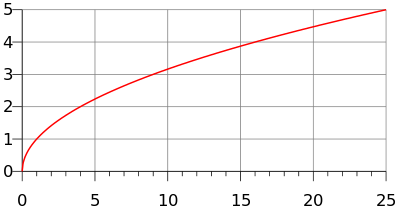
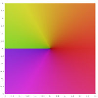
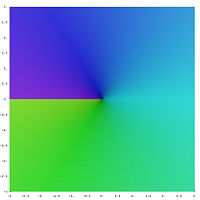
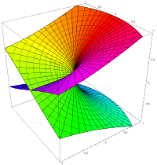
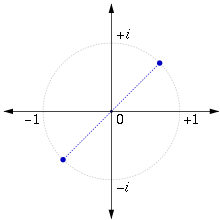
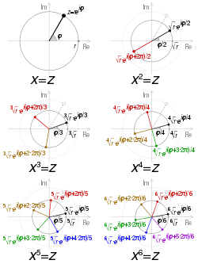

Square root {#firstHeading .firstHeading lang="en"}
===========

From Wikipedia, the free encyclopedia

Jump to: [navigation](Square_root.html#mw-head),
[search](Square_root.html#p-search)

"Square roots" redirects here. For other uses, see [Square Roots
(disambiguation)](https://en.wikipedia.org/wiki/Square_Roots_(disambiguation) "Square Roots (disambiguation)"){.mw-disambig}.

[{.thumbimage
width="256" height="256"
srcset="//upload.wikimedia.org/wikipedia/commons/thumb/3/3e/Nuvola_apps_edu_mathematics_blue-p.svg/384px-Nuvola_apps_edu_mathematics_blue-p.svg.png 1.5x, //upload.wikimedia.org/wikipedia/commons/thumb/3/3e/Nuvola_apps_edu_mathematics_blue-p.svg/512px-Nuvola_apps_edu_mathematics_blue-p.svg.png 2x"}](https://en.wikipedia.org/wiki/File:Nuvola_apps_edu_mathematics_blue-p.svg){.image}

{.internal}

The mathematical expression "The (principal) square root of x"

In
[mathematics](https://en.wikipedia.org/wiki/Mathematics "Mathematics"),
a **square root** of a number *a* is a number *y* such that [*y*^2^ =
*a*]{.nowrap}; in other words, a number *y* whose
*[square](https://en.wikipedia.org/wiki/Square_(algebra) "Square (algebra)")*
(the result of multiplying the number by itself, or [*y*⋅*y*]{.nowrap})
is *a*.^[\[1\]](Square_root.html#cite_note-1)^ For example, 4 and −4 are
square roots of 16 because [4^2^ = (−4)^2^ = 16]{.nowrap}. Every
nonnegative [real
number](https://en.wikipedia.org/wiki/Real_number "Real number") *a* has
a unique nonnegative square root, called the *principal square root*,
which is denoted by
[√[*a*]{style="border-top:1px solid; padding:0 0.1em;"}]{.nowrap}, where
√ is called the *[radical
sign](https://en.wikipedia.org/wiki/Radical_sign "Radical sign"){.mw-redirect}*
or *radix*. For example, the principal square root of 9 is 3, denoted
[√[9]{style="border-top:1px solid; padding:0 0.1em;"}]{.nowrap} = 3,
because [3^2^ = 3 • 3 = 9]{.nowrap} and 3 is nonnegative. The term whose
root is being considered is known as the *radicand*. The radicand is the
number or expression underneath the radical sign, in this example 9.

Every positive number *a* has two square roots:
[√[*a*]{style="border-top:1px solid; padding:0 0.1em;"}]{.nowrap}, which
is positive, and
−[√[*a*]{style="border-top:1px solid; padding:0 0.1em;"}]{.nowrap},
which is negative. Together, these two roots are denoted ±
[√[*a*]{style="border-top:1px solid; padding:0 0.1em;"}]{.nowrap} (see
[±
shorthand](https://en.wikipedia.org/wiki/%C2%B1_shorthand "± shorthand"){.mw-redirect}).
Although the principal square root of a positive number is only one of
its two square roots, the designation "*the* square root" is often used
to refer to the *principal square root*. For positive *a*, the principal
square root can also be written in
[exponent](https://en.wikipedia.org/wiki/Exponentiation "Exponentiation")
notation, as *a*^1/2^.^[\[2\]](Square_root.html#cite_note-2)^

Square roots of negative numbers can be discussed within the framework
of [complex
numbers](https://en.wikipedia.org/wiki/Complex_number "Complex number").
More generally, square roots can be considered in any context in which a
notion of "squaring" of some mathematical objects is defined (including
[algebras of
matrices](https://en.wikipedia.org/wiki/Matrix_(mathematics) "Matrix (mathematics)"),
[endomorphism
rings](https://en.wikipedia.org/wiki/Endomorphism_ring "Endomorphism ring"),
etc.)

Contents
--------

-   [[1]{.tocnumber} [History]{.toctext}](Square_root.html#History)
-   [[2]{.tocnumber} [Properties and
    uses]{.toctext}](Square_root.html#Properties_and_uses)
-   [[3]{.tocnumber}
    [Computation]{.toctext}](Square_root.html#Computation)
-   [[4]{.tocnumber} [Square roots of negative and complex
    numbers]{.toctext}](Square_root.html#Square_roots_of_negative_and_complex_numbers)
    -   [[4.1]{.tocnumber} [Square root of an imaginary
        number]{.toctext}](Square_root.html#Square_root_of_an_imaginary_number)
    -   [[4.2]{.tocnumber} [Principal square root of a complex
        number]{.toctext}](Square_root.html#Principal_square_root_of_a_complex_number)
    -   [[4.3]{.tocnumber} [Algebraic
        formula]{.toctext}](Square_root.html#Algebraic_formula)
    -   [[4.4]{.tocnumber} [Notes]{.toctext}](Square_root.html#Notes)
-   [[5]{.tocnumber} [Square roots of matrices and
    operators]{.toctext}](Square_root.html#Square_roots_of_matrices_and_operators)
-   [[6]{.tocnumber} [In integral domains, including
    fields]{.toctext}](Square_root.html#In_integral_domains.2C_including_fields)
-   [[7]{.tocnumber} [In rings in
    general]{.toctext}](Square_root.html#In_rings_in_general)
-   [[8]{.tocnumber} [Principal square roots of the positive
    integers]{.toctext}](Square_root.html#Principal_square_roots_of_the_positive_integers)
    -   [[8.1]{.tocnumber} [As decimal
        expansions]{.toctext}](Square_root.html#As_decimal_expansions)
    -   [[8.2]{.tocnumber} [As expansions in other numeral
        systems]{.toctext}](Square_root.html#As_expansions_in_other_numeral_systems)
    -   [[8.3]{.tocnumber} [As periodic continued
        fractions]{.toctext}](Square_root.html#As_periodic_continued_fractions)
-   [[9]{.tocnumber} [Geometric construction of the square
    root]{.toctext}](Square_root.html#Geometric_construction_of_the_square_root)
-   [[10]{.tocnumber} [See also]{.toctext}](Square_root.html#See_also)
-   [[11]{.tocnumber} [Notes]{.toctext}](Square_root.html#Notes_2)
-   [[12]{.tocnumber}
    [References]{.toctext}](Square_root.html#References)
-   [[13]{.tocnumber} [External
    links]{.toctext}](Square_root.html#External_links)

[History]{#History .mw-headline}[[\[]{.mw-editsection-bracket}[\]]{.mw-editsection-bracket}]{.mw-editsection}
-------------------------------------------------------------------------------------------------------------------------------------------------------------------------------------------------------------------------

The [Yale Babylonian
Collection](https://en.wikipedia.org/wiki/Yale_Babylonian_Collection "Yale Babylonian Collection")
[YBC 7289](https://en.wikipedia.org/wiki/YBC_7289 "YBC 7289"){.mw-redirect}
clay tablet was created between 1800 BC and 1600 C, showing
[√[2]{style="border-top:1px solid; padding:0 0.1em;"}]{.nowrap} and
[√[2]{style="border-top:1px solid; padding:0 0.1em;"}]{.nowrap}/2 =
1/[√[2]{style="border-top:1px solid; padding:0 0.1em;"}]{.nowrap} as
1;24,51,10 and 0;42,25,35 base 60 numbers on a square crossed by two
diagonals.^[\[3\]](Square_root.html#cite_note-3)^

The [Rhind Mathematical
Papyrus](https://en.wikipedia.org/wiki/Rhind_Mathematical_Papyrus "Rhind Mathematical Papyrus")
is a copy from 1650 BC of an earlier [Berlin
Papyrus](https://en.wikipedia.org/wiki/Berlin_Papyrus_6619 "Berlin Papyrus 6619")
and other texts – possibly the [Kahun
Papyrus](https://en.wikipedia.org/wiki/Kahun_Papyrus "Kahun Papyrus"){.mw-redirect} –
that shows how the Egyptians extracted square roots by an inverse
proportion method.^[\[4\]](Square_root.html#cite_note-4)^

In [Ancient
India](https://en.wikipedia.org/wiki/History_of_India "History of India"),
the knowledge of theoretical and applied aspects of square and square
root was at least as old as the *[Sulba
Sutras](https://en.wikipedia.org/wiki/Sulba_Sutras "Sulba Sutras"){.mw-redirect}*,
dated around 800–500 BC (possibly much
earlier).^\[*[[citation\ needed]{title="no manuscript dates back that far and reliable secondary sources disagree (July 2010)"}](https://en.wikipedia.org/wiki/Wikipedia:Citation_needed "Wikipedia:Citation needed")*\]^
A method for finding very good approximations to the square roots of 2
and 3 are given in the *[Baudhayana Sulba
Sutra](https://en.wikipedia.org/wiki/Baudhayana_Sulba_Sutra "Baudhayana Sulba Sutra"){.mw-redirect}*.^[\[5\]](Square_root.html#cite_note-5)^
[Aryabhata](https://en.wikipedia.org/wiki/Aryabhata "Aryabhata") in the
*[Aryabhatiya](https://en.wikipedia.org/wiki/Aryabhatiya "Aryabhatiya")*
(section 2.4), has given a method for finding the square root of numbers
having many digits.

It was known to the ancient Greeks that square roots of [positive whole
numbers](https://en.wikipedia.org/wiki/Natural_number "Natural number")
that are not [perfect
squares](https://en.wikipedia.org/wiki/Square_number "Square number")
are always [irrational
numbers](https://en.wikipedia.org/wiki/Irrational_number "Irrational number"):
numbers not expressible as a
[ratio](https://en.wikipedia.org/wiki/Ratio "Ratio") of two integers
(that is to say they cannot be written exactly as *m/n*, where *m* and
*n* are integers). This is the theorem [*Euclid X,
9*](https://en.wikipedia.org/wiki/Euclid%27s_Elements "Euclid's Elements")
almost certainly due to
[Theaetetus](https://en.wikipedia.org/wiki/Theaetetus_(mathematician) "Theaetetus (mathematician)")
dating back to circa 380 BC.^[\[6\]](Square_root.html#cite_note-6)^ The
particular case
[[√[2]{style="border-top:1px solid; padding:0 0.1em;"}]{.nowrap}](https://en.wikipedia.org/wiki/Square_root_of_2 "Square root of 2")
is assumed to date back earlier to the
[Pythagoreans](https://en.wikipedia.org/wiki/Pythagoreanism "Pythagoreanism")
and is traditionally attributed to
[Hippasus](https://en.wikipedia.org/wiki/Hippasus "Hippasus").^\[*[[citation\ needed]{title="This claim needs references to reliable sources. (October 2012)"}](https://en.wikipedia.org/wiki/Wikipedia:Citation_needed "Wikipedia:Citation needed")*\]^
It is exactly the length of the
[diagonal](https://en.wikipedia.org/wiki/Diagonal "Diagonal") of a
[square with side length
1](https://en.wikipedia.org/wiki/Unit_square "Unit square").

In the Chinese mathematical work *[Writings on
Reckoning](https://en.wikipedia.org/wiki/Su%C3%A0n_sh%C3%B9_sh%C5%AB "Suàn shù shū"){.mw-redirect}*,
written between 202 BC and 186 BC during the early [Han
Dynasty](https://en.wikipedia.org/wiki/Han_Dynasty "Han Dynasty"){.mw-redirect},
the square root is approximated by using an "excess and deficiency"
method, which says to "...combine the excess and deficiency as the
divisor; (taking) the deficiency numerator multiplied by the excess
denominator and the excess numerator times the deficiency denominator,
combine them as the dividend."^[\[7\]](Square_root.html#cite_note-7)^

[Mahāvīra](https://en.wikipedia.org/wiki/Mah%C4%81v%C4%ABra_(mathematician) "Mahāvīra (mathematician)"),
a 9th-century Indian mathematician, was the first to state that square
roots of negative numbers do not
exist.^[\[8\]](Square_root.html#cite_note-FOOTNOTESelin20081268-8)^

A symbol for square roots, written as an elaborate R, was invented by
[Regiomontanus](https://en.wikipedia.org/wiki/Regiomontanus "Regiomontanus")
(1436–1476). An R was also used for Radix to indicate square roots in
[Gerolamo
Cardano](https://en.wikipedia.org/wiki/Gerolamo_Cardano "Gerolamo Cardano")'s
[Ars
Magna](https://en.wikipedia.org/wiki/Ars_Magna_(Gerolamo_Cardano) "Ars Magna (Gerolamo Cardano)").^[\[9\]](Square_root.html#cite_note-9)^

According to historian of mathematics [D.E.
Smith](https://en.wikipedia.org/wiki/David_Eugene_Smith "David Eugene Smith"),
Aryabhata's method for finding the square root was first introduced in
Europe by
[Cataneo](https://en.wikipedia.org/wiki/Pietro_di_Giacomo_Cataneo "Pietro di Giacomo Cataneo")
in 1546.

According to Jeffrey A. Oaks, Arabs used the letter
*[jīm/ĝīm](https://en.wikipedia.org/wiki/Gimel#Arabic_.C4.9D.C4.ABm "Gimel")*
([ج]{lang="ar" lang="ar"}), the first letter of the word
“[جذر]{lang="ar" lang="ar"}” (variously transliterated as *jaḏr*,
*jiḏr*, *ǧaḏr* or *ǧiḏr*, “root”), placed in its initial form
([ﺟ]{lang="ar" lang="ar"}) over a number to indicate its square root.
The letter *jīm* resembles the present square root shape. Its usage goes
as far as the end of the twelfth century in the works of the Moroccan
mathematician [Ibn
al-Yasamin](https://en.wikipedia.org/wiki/Ibn_al-Yasamin "Ibn al-Yasamin").^[\[10\]](Square_root.html#cite_note-10)^

The symbol '√' for the square root was first used in print in 1525 in
[Christoph
Rudolff](https://en.wikipedia.org/wiki/Christoph_Rudolff "Christoph Rudolff")'s
*Coss*.^[\[11\]](Square_root.html#cite_note-11)^

[Properties and uses]{#Properties_and_uses .mw-headline}[[\[]{.mw-editsection-bracket}[\]]{.mw-editsection-bracket}]{.mw-editsection}
-------------------------------------------------------------------------------------------------------------------------------------------------------------------------------------------------------------------------------------------------------------

[{.thumbimage
width="400" height="208"
srcset="//upload.wikimedia.org/wikipedia/commons/thumb/4/4a/Square_root_0_25.svg/600px-Square_root_0_25.svg.png 1.5x, //upload.wikimedia.org/wikipedia/commons/thumb/4/4a/Square_root_0_25.svg/800px-Square_root_0_25.svg.png 2x"}](https://en.wikipedia.org/wiki/File:Square_root_0_25.svg){.image}

{.internal}

The graph of the function *f*(*x*) =
[√[*x*]{style="border-top:1px solid; padding:0 0.1em;"}]{.nowrap}, made
up of half a
[parabola](https://en.wikipedia.org/wiki/Parabola "Parabola") with a
vertical
[directrix](https://en.wikipedia.org/wiki/Directrix_(conic_section)#Eccentricity.2C_focus_and_directrix "Directrix (conic section)"){.mw-redirect}

The principal square root function *f*(*x*) =
[√[*x*]{style="border-top:1px solid; padding:0 0.1em;"}]{.nowrap}
(usually just referred to as the "square root function") is a
[function](https://en.wikipedia.org/wiki/Function_(mathematics) "Function (mathematics)")
that maps the
[set](https://en.wikipedia.org/wiki/Set_(mathematics) "Set (mathematics)")
of nonnegative real numbers onto itself. In
[geometrical](https://en.wikipedia.org/wiki/Geometry "Geometry") terms,
the square root function maps the
[area](https://en.wikipedia.org/wiki/Area "Area") of a square to its
side length.

The square root of *x* is rational if and only if *x* is a [rational
number](https://en.wikipedia.org/wiki/Rational_number "Rational number")
that can be represented as a ratio of two perfect squares. (See [square
root of
2](https://en.wikipedia.org/wiki/Square_root_of_2 "Square root of 2")
for proofs that this is an irrational number, and [quadratic
irrational](https://en.wikipedia.org/wiki/Quadratic_irrational "Quadratic irrational"){.mw-redirect}
for a proof for all non-square natural numbers.) The square root
function maps rational numbers into [algebraic
numbers](https://en.wikipedia.org/wiki/Algebraic_number "Algebraic number")
(a
[superset](https://en.wikipedia.org/wiki/Superset "Superset"){.mw-redirect}
of the rational numbers).

For all real numbers *x*

[[$\sqrt{x^{2}} = \left| x \right| = \begin{cases}
{x,} & {\text{if~}x \geq 0} \\
{- x,} & {\text{if~}x < 0.} \\
\end{cases}$]{.mwe-math-mathml-inline .mwe-math-mathml-a11y
style="display: none;"}{.mwe-math-fallback-image-inline}]{.mwe-math-element}
    (see [absolute
value](https://en.wikipedia.org/wiki/Absolute_value "Absolute value"))
For all nonnegative real numbers *x* and *y*,

[[$\sqrt{xy} = \sqrt{x}\sqrt{y}$]{.mwe-math-mathml-inline
.mwe-math-mathml-a11y style="display: none;"}{.mwe-math-fallback-image-inline}]{.mwe-math-element}
and

[[$\sqrt{x} = x^{1/2}.$]{.mwe-math-mathml-inline .mwe-math-mathml-a11y
style="display: none;"}{.mwe-math-fallback-image-inline}]{.mwe-math-element}
The square root function is
[continuous](https://en.wikipedia.org/wiki/Continuous_function "Continuous function")
for all nonnegative *x* and
[differentiable](https://en.wikipedia.org/wiki/Derivative "Derivative")
for all positive *x*. If *f* denotes the square-root function, its
derivative is given by:

[[$f^{\prime}(x) = \frac{1}{2\sqrt{x}}.$]{.mwe-math-mathml-inline
.mwe-math-mathml-a11y style="display: none;"}{.mwe-math-fallback-image-inline}]{.mwe-math-element}
The [Taylor
series](https://en.wikipedia.org/wiki/Taylor_series "Taylor series") of
[√[1 + *x*]{style="border-top:1px solid; padding:0 0.1em;"}]{.nowrap}
about *x* = 0 converges for | *x* | ≤ 1 and is given by

[[$\sqrt{1 + x} = \sum\limits_{n = 0}^{\infty}\frac{( - 1)^{n}(2n)!}{(1 - 2n)(n!)^{2}(4^{n})}x^{n} = 1 + {\frac{1}{2}x - \frac{1}{8}x^{2} + \frac{1}{16}x^{3} - \frac{5}{128}x^{4} + \ldots,\!}$]{.mwe-math-mathml-inline
.mwe-math-mathml-a11y style="display: none;"}{.mwe-math-fallback-image-inline}]{.mwe-math-element}
The square root of a nonnegative number is used in the definition of
[Euclidean
norm](https://en.wikipedia.org/wiki/Euclidean_norm "Euclidean norm"){.mw-redirect}
(and
[distance](https://en.wikipedia.org/wiki/Euclidean_distance "Euclidean distance")),
as well as in generalizations such as [Hilbert
spaces](https://en.wikipedia.org/wiki/Hilbert_space "Hilbert space"). It
defines an important concept of [standard
deviation](https://en.wikipedia.org/wiki/Standard_deviation "Standard deviation")
used in probability theory and statistics. It has a major use in the
formula for roots of a [quadratic
equation](https://en.wikipedia.org/wiki/Quadratic_equation "Quadratic equation");
[quadratic
fields](https://en.wikipedia.org/wiki/Quadratic_field "Quadratic field")
and rings of [quadratic
integers](https://en.wikipedia.org/wiki/Quadratic_integer "Quadratic integer"),
which are based on square roots, are important in algebra and have uses
in geometry. Square roots frequently appear in mathematical formulas
elsewhere, as well as in many
[physical](https://en.wikipedia.org/wiki/Physics "Physics") laws.

[Computation]{#Computation .mw-headline}[[\[]{.mw-editsection-bracket}[\]]{.mw-editsection-bracket}]{.mw-editsection}
-------------------------------------------------------------------------------------------------------------------------------------------------------------------------------------------------------------------------------------

Main article: [Methods of computing square
roots](https://en.wikipedia.org/wiki/Methods_of_computing_square_roots "Methods of computing square roots")

Most [pocket
calculators](https://en.wikipedia.org/wiki/Pocket_calculator "Pocket calculator"){.mw-redirect}
have a square root key. Computer
[spreadsheets](https://en.wikipedia.org/wiki/Spreadsheet "Spreadsheet")
and other [software](https://en.wikipedia.org/wiki/Software "Software")
are also frequently used to calculate square roots. Pocket calculators
typically implement efficient routines, such as the [Newton's
method](https://en.wikipedia.org/wiki/Newton%27s_method "Newton's method")
(frequently with an initial guess of 1), to compute the square root of a
positive real
number.^[\[12\]](Square_root.html#cite_note-12)[\[13\]](Square_root.html#cite_note-13)^
When computing square roots with [logarithm
tables](https://en.wikipedia.org/wiki/Common_logarithm "Common logarithm")
or [slide rules](https://en.wikipedia.org/wiki/Slide_rule "Slide rule"),
one can exploit the identities

[[$\sqrt{a} = e^{(\ln a)/2} = 10^{(\log_{10}a)/2},$]{.mwe-math-mathml-inline
.mwe-math-mathml-a11y style="display: none;"}{.mwe-math-fallback-image-inline}]{.mwe-math-element}
where [ln]{.texhtml} and [log]{.texhtml}~10~ are the
[natural](https://en.wikipedia.org/wiki/Natural_logarithm "Natural logarithm")
and [base-10
logarithms](https://en.wikipedia.org/wiki/Base-10_logarithm "Base-10 logarithm"){.mw-redirect}.

By trial-and-error,^[\[14\]](Square_root.html#cite_note-14)^ one can
square an estimate for
[√[*a*]{style="border-top:1px solid; padding:0 0.1em;"}]{.nowrap} and
raise or lower the estimate until it agrees to sufficient accuracy. For
this technique it's prudent to use the identity

[[$(x + c)^{2} = x^{2} + 2xc + c^{2},$]{.mwe-math-mathml-inline
.mwe-math-mathml-a11y style="display: none;"}{.mwe-math-fallback-image-inline}]{.mwe-math-element}
as it allows one to adjust the estimate *x* by some amount *c* and
measure the square of the adjustment in terms of the original estimate
and its square. Furthermore, (*x* + *c*)^2^ ≈ *x*^2^ + 2*xc* when *c* is
close to 0, because the [tangent
line](https://en.wikipedia.org/wiki/Tangent_line "Tangent line"){.mw-redirect}
to the graph of *x*^2^ + 2*xc* + *c*^2^ at *c*=0, as a function of *c*
alone, is *y* = 2*xc* + *x*^2^. Thus, small adjustments to *x* can be
planned out by setting 2*xc* to *a*, or *c*=*a*/(2*x*).

The most common [iterative
method](https://en.wikipedia.org/wiki/Iterative_method "Iterative method")
of square root calculation by hand is known as the "[Babylonian
method](https://en.wikipedia.org/wiki/Babylonian_method "Babylonian method"){.mw-redirect}"
or "Heron's method" after the first-century Greek philosopher [Heron of
Alexandria](https://en.wikipedia.org/wiki/Hero_of_Alexandria "Hero of Alexandria"),
who first described it.^[\[15\]](Square_root.html#cite_note-15)^ The
method uses the same iterative scheme as the [Newton–Raphson
method](https://en.wikipedia.org/wiki/Newton%E2%80%93Raphson_method "Newton–Raphson method"){.mw-redirect}
yields when applied to the function y = *f*(*x*) = *x*^2^ − *a*, using
the fact that its slope at any point is *dy*/*dx* = *f'*(*x*) = 2*x*,
but predates it by many
centuries.^[\[16\]](Square_root.html#cite_note-16)^ The algorithm is to
repeat a simple calculation that results in a number closer to the
actual square root each time it is repeated with its result as the new
input. The motivation is that if *x* is an overestimate to the square
root of a nonnegative real number *a* then *a*/*x* will be an
underestimate and so the average of these two numbers is a better
approximation than either of them. However, the [inequality of
arithmetic and geometric
means](https://en.wikipedia.org/wiki/Inequality_of_arithmetic_and_geometric_means "Inequality of arithmetic and geometric means")
shows this average is always an overestimate of the square root (as
noted
[below](Square_root.html#Geometric_construction_of_the_square_root "Square root")),
and so it can serve as a new overestimate with which to repeat the
process, which
[converges](https://en.wikipedia.org/wiki/Limit_of_a_sequence "Limit of a sequence")
as a consequence of the successive overestimates and underestimates
being closer to each other after each iteration. To find *x*:

1.  Start with an arbitrary positive start value *x*. The closer to the
    square root of *a*, the fewer the iterations that will be needed to
    achieve the desired precision.
2.  Replace *x* by the average (*x* + *a*/*x*) / 2 between *x* and
    *a*/*x*.
3.  Repeat from step 2, using this average as the new value of *x*.

That is, if an arbitrary guess for
[√[*a*]{style="border-top:1px solid; padding:0 0.1em;"}]{.nowrap} is
*x*~0~, and [*x*~*n*\ +\ 1~ = (*x~n~* + *a*/*x~n~*) / 2]{.nowrap}, then
each x~n~ is an approximation of
[√[*a*]{style="border-top:1px solid; padding:0 0.1em;"}]{.nowrap} which
is better for large *n* than for small *n*. If *a* is positive, the
convergence is
[quadratic](https://en.wikipedia.org/wiki/Rate_of_convergence "Rate of convergence"),
which means that in approaching the limit, the number of correct digits
roughly doubles in each next iteration. If [*a* = 0]{.nowrap}, the
convergence is only linear.

Using the identity

[[$\sqrt{a} = 2^{- n}\sqrt{4^{n}a},$]{.mwe-math-mathml-inline
.mwe-math-mathml-a11y style="display: none;"}{.mwe-math-fallback-image-inline}]{.mwe-math-element}
the computation of the square root of a positive number can be reduced
to that of a number in the range [\[1,4)]{.texhtml}. This simplifies
finding a start value for the iterative method that is close to the
square root, for which a
[polynomial](https://en.wikipedia.org/wiki/Polynomial_function "Polynomial function"){.mw-redirect}
or
[piecewise-linear](https://en.wikipedia.org/wiki/Piecewise_linear_function "Piecewise linear function")
[approximation](https://en.wikipedia.org/wiki/Approximation_theory "Approximation theory")
can be used.

The [time
complexity](https://en.wikipedia.org/wiki/Computational_complexity_theory "Computational complexity theory")
for computing a square root with *n* digits of precision is equivalent
to that of multiplying two *n*-digit numbers.

Another useful method for calculating the square root is the [shifting
nth root
algorithm](https://en.wikipedia.org/wiki/Shifting_nth_root_algorithm "Shifting nth root algorithm"),
applied for [*n* = 2]{.nowrap}.

The name of the square root
[function](https://en.wikipedia.org/wiki/Function_(programming) "Function (programming)"){.mw-redirect}
varies from [programming
language](https://en.wikipedia.org/wiki/Programming_language "Programming language")
to programming language, with
`sqrt`^[\[17\]](Square_root.html#cite_note-17)^ (often pronounced
"squirt" ^[\[18\]](Square_root.html#cite_note-18)^) being common, used
in
[C](https://en.wikipedia.org/wiki/C_(programming_language) "C (programming language)"),
[C++](https://en.wikipedia.org/wiki/C%2B%2B "C++"), and derived
languages like
[JavaScript](https://en.wikipedia.org/wiki/JavaScript "JavaScript"),
[PHP](https://en.wikipedia.org/wiki/PHP "PHP"), and
[Python](https://en.wikipedia.org/wiki/Python_(programming_language) "Python (programming language)").

[Square roots of negative and complex numbers]{#Square_roots_of_negative_and_complex_numbers .mw-headline}[[\[]{.mw-editsection-bracket}[\]]{.mw-editsection-bracket}]{.mw-editsection}
----------------------------------------------------------------------------------------------------------------------------------------------------------------------------------------------------------------------------------------------------------------------------------------------------------------------------------------

[{width="200"
height="200"
srcset="//upload.wikimedia.org/wikipedia/commons/thumb/e/e2/Complex_sqrt_leaf1.jpg/300px-Complex_sqrt_leaf1.jpg 1.5x, //upload.wikimedia.org/wikipedia/commons/thumb/e/e2/Complex_sqrt_leaf1.jpg/400px-Complex_sqrt_leaf1.jpg 2x"}](https://en.wikipedia.org/wiki/File:Complex_sqrt_leaf1.jpg){.image}

First leaf of the complex square root

[{width="200"
height="200"
srcset="//upload.wikimedia.org/wikipedia/commons/thumb/f/f6/Complex_sqrt_leaf2.jpg/300px-Complex_sqrt_leaf2.jpg 1.5x, //upload.wikimedia.org/wikipedia/commons/thumb/f/f6/Complex_sqrt_leaf2.jpg/400px-Complex_sqrt_leaf2.jpg 2x"}](https://en.wikipedia.org/wiki/File:Complex_sqrt_leaf2.jpg){.image}

Second leaf of the complex square root

[{width="200"
height="210"
srcset="//upload.wikimedia.org/wikipedia/commons/thumb/a/aa/Riemann_surface_sqrt.svg/300px-Riemann_surface_sqrt.svg.png 1.5x, //upload.wikimedia.org/wikipedia/commons/thumb/a/aa/Riemann_surface_sqrt.svg/400px-Riemann_surface_sqrt.svg.png 2x"}](https://en.wikipedia.org/wiki/File:Riemann_surface_sqrt.svg){.image}

Using the [Riemann
surface](https://en.wikipedia.org/wiki/Riemann_surface "Riemann surface")
of the square root, it is shown how the two leaves fit together

The square of any positive or negative number is positive, and the
square of 0 is 0. Therefore, no negative number can have a
[real](https://en.wikipedia.org/wiki/Real_number "Real number") square
root. However, it is possible to work with a more inclusive set of
numbers, called the [complex
numbers](https://en.wikipedia.org/wiki/Complex_number "Complex number"),
that does contain solutions to the square root of a negative number.
This is done by introducing a new number, denoted by *i* (sometimes *j*,
especially in the context of
[electricity](https://en.wikipedia.org/wiki/Electric_current "Electric current")
where "*i*" traditionally represents electric current) and called the
[imaginary
unit](https://en.wikipedia.org/wiki/Imaginary_unit "Imaginary unit"),
which is *defined* such that [*i*^2^ = −1]{.nowrap}. Using this
notation, we can think of *i* as the square root of −1, but notice that
we also have [(−*i*)^2^ = *i*^2^ = −1]{.nowrap} and so −*i* is also a
square root of −1. By convention, the principal square root of −1 is
*i*, or more generally, if *x* is any nonnegative number, then the
principal square root of −*x* is

[[$\sqrt{- x} = i\sqrt{x}.$]{.mwe-math-mathml-inline
.mwe-math-mathml-a11y style="display: none;"}{.mwe-math-fallback-image-inline}]{.mwe-math-element}
The right side (as well as its negative) is indeed a square root of
−*x*, since

[[$(i\sqrt{x})^{2} = i^{2}(\sqrt{x})^{2} = ( - 1)x = - x.$]{.mwe-math-mathml-inline
.mwe-math-mathml-a11y style="display: none;"}{.mwe-math-fallback-image-inline}]{.mwe-math-element}
For every non-zero complex number *z* there exist precisely two numbers
*w* such that [*w*^2^ = *z*]{.nowrap}: the principal square root of *z*
(defined below), and its negative.

### [Square root of an imaginary number]{#Square_root_of_an_imaginary_number .mw-headline}[[\[]{.mw-editsection-bracket}[\]]{.mw-editsection-bracket}]{.mw-editsection}

[{.thumbimage
width="220" height="220"
srcset="//upload.wikimedia.org/wikipedia/commons/thumb/3/32/Imaginary2Root.svg/330px-Imaginary2Root.svg.png 1.5x, //upload.wikimedia.org/wikipedia/commons/thumb/3/32/Imaginary2Root.svg/440px-Imaginary2Root.svg.png 2x"}](https://en.wikipedia.org/wiki/File:Imaginary2Root.svg){.image}

{.internal}

The square roots of ***i*** in the complex plane

The square root of ***i*** is given by

[[$\sqrt{i} = \frac{1}{2}\sqrt{2} + i\frac{1}{2}\sqrt{2} = \frac{\sqrt{2}}{2}(1 + i).$]{.mwe-math-mathml-inline
.mwe-math-mathml-a11y style="display: none;"}{.mwe-math-fallback-image-inline}]{.mwe-math-element}
This result can be obtained
[algebraically](https://en.wikipedia.org/wiki/Algebra "Algebra") by
finding *a* and *b* such that

[[$i = (a + bi)^{2}\!$]{.mwe-math-mathml-inline .mwe-math-mathml-a11y
style="display: none;"}{.mwe-math-fallback-image-inline}]{.mwe-math-element}
or equivalently

[[$i = a^{2} + 2abi - b^{2}.\!$]{.mwe-math-mathml-inline
.mwe-math-mathml-a11y style="display: none;"}{.mwe-math-fallback-image-inline}]{.mwe-math-element}
This gives the two [simultaneous
equations](https://en.wikipedia.org/wiki/Simultaneous_equations "Simultaneous equations")

[[$\left\{ \begin{array}{l}
{2ab = 1\!} \\
{a^{2} - b^{2} = 0\!} \\
\end{array} \right.$]{.mwe-math-mathml-inline .mwe-math-mathml-a11y
style="display: none;"}{.mwe-math-fallback-image-inline}]{.mwe-math-element}
with solutions

[[$a = b = \pm \frac{1}{\sqrt{2}}.$]{.mwe-math-mathml-inline
.mwe-math-mathml-a11y style="display: none;"}{.mwe-math-fallback-image-inline}]{.mwe-math-element}
The choice of the principal root then gives

[[$a = b = \frac{1}{\sqrt{2}}.$]{.mwe-math-mathml-inline
.mwe-math-mathml-a11y style="display: none;"}{.mwe-math-fallback-image-inline}]{.mwe-math-element}
The result can also be obtained by using [de Moivre's
formula](https://en.wikipedia.org/wiki/De_Moivre%27s_formula "De Moivre's formula")
and setting

[[$i = \cos\left( \frac{\pi}{2} \right) + i\sin\left( \frac{\pi}{2} \right)$]{.mwe-math-mathml-inline
.mwe-math-mathml-a11y style="display: none;"}{.mwe-math-fallback-image-inline}]{.mwe-math-element}
which produces

[[$\begin{array}{ll}
\sqrt{i} & {= \left( \cos\left( \frac{\pi}{2} \right) + i\sin\left( \frac{\pi}{2} \right) \right)^{\frac{1}{2}}} \\
 & {= \cos\left( \frac{\pi}{4} \right) + i\sin\left( \frac{\pi}{4} \right)} \\
 & {= \frac{1}{\sqrt{2}} + i\left( \frac{1}{\sqrt{2}} \right) = \frac{1}{\sqrt{2}}(1 + i).} \\
\end{array}$]{.mwe-math-mathml-inline .mwe-math-mathml-a11y
style="display: none;"}{.mwe-math-fallback-image-inline}]{.mwe-math-element}
### [Principal square root of a complex number]{#Principal_square_root_of_a_complex_number .mw-headline}[[\[]{.mw-editsection-bracket}[\]]{.mw-editsection-bracket}]{.mw-editsection}

[{.thumbimage
width="250" height="333"
srcset="//upload.wikimedia.org/wikipedia/commons/thumb/a/aa/Visualisation_complex_number_roots.svg/375px-Visualisation_complex_number_roots.svg.png 1.5x, //upload.wikimedia.org/wikipedia/commons/thumb/a/aa/Visualisation_complex_number_roots.svg/500px-Visualisation_complex_number_roots.svg.png 2x"}](https://en.wikipedia.org/wiki/File:Visualisation_complex_number_roots.svg){.image}

{.internal}

Visualisation of the square to sixth roots of a complex number *z*, in
polar form [*re*^*iφ*^]{.nowrap} where [*φ* = arg *z*]{.nowrap} and [*r*
= |*z* |]{.nowrap} – if *z* is real, [*φ* = 0 or
[π]{.texhtml}]{.nowrap}. Principal roots are in black.

To find a definition for the square root that allows us to consistently
choose a single value, called the [principal
value](https://en.wikipedia.org/wiki/Principal_value "Principal value"),
we start by observing that any complex number *x* + *iy* can be viewed
as a point in the plane, (*x*, *y*), expressed using [Cartesian
coordinates](https://en.wikipedia.org/wiki/Cartesian_coordinate_system "Cartesian coordinate system").
The same point may be reinterpreted using [polar
coordinates](https://en.wikipedia.org/wiki/Polar_coordinates "Polar coordinates"){.mw-redirect}
as the pair (*r*, φ), where *r* ≥ 0 is the distance of the point from
the origin, and φ is the angle that the line from the origin to the
point makes with the positive real (*x*) axis. In complex analysis, this
value is conventionally written *r* *e*^*iφ*^. If

[[$z = re^{i\varphi}\text{~with~} - \pi < \varphi \leq \pi,$]{.mwe-math-mathml-inline
.mwe-math-mathml-a11y style="display: none;"}{.mwe-math-fallback-image-inline}]{.mwe-math-element}
then we define the principal square root of *z* as follows:

[[$\sqrt{z} = \sqrt{r}\, e^{i\varphi/2}.$]{.mwe-math-mathml-inline
.mwe-math-mathml-a11y style="display: none;"}{.mwe-math-fallback-image-inline}]{.mwe-math-element}
The principal square root function is thus defined using the nonpositive
real axis as a [branch
cut](https://en.wikipedia.org/wiki/Branch_cut "Branch cut"){.mw-redirect}.
The principal square root function is
[holomorphic](https://en.wikipedia.org/wiki/Holomorphic_function "Holomorphic function")
everywhere except on the set of non-positive real numbers (on strictly
negative reals it isn't even
[continuous](https://en.wikipedia.org/wiki/Continuous_function "Continuous function")).
The above Taylor series for [√[1 +
*x*]{style="border-top:1px solid; padding:0 0.1em;"}]{.nowrap} remains
valid for complex numbers *x* with [| *x* | &lt; 1]{.nowrap}.

The above can also be expressed in terms of [trigonometric
functions](https://en.wikipedia.org/wiki/Trigonometric_function "Trigonometric function"){.mw-redirect}:

[[$\sqrt{r\left( \cos\varphi + i\,\sin\varphi \right)} = \sqrt{r}\left\lbrack \cos\frac{\varphi}{2} + i\sin\frac{\varphi}{2} \right\rbrack.$]{.mwe-math-mathml-inline
.mwe-math-mathml-a11y style="display: none;"}![\\sqrt{r \\left(\\cos
\\varphi + i \\, \\sin \\varphi \\right)} = \\sqrt{r} \\left \[ \\cos
\\frac{\\varphi}{2} + i \\sin \\frac{\\varphi}{2} \\right \]
.](../../wikimedia.org/api/rest_v1/media/math/render/svg/47903b69e7821be0b699b0ae811ed787064d6c75){.mwe-math-fallback-image-inline}]{.mwe-math-element}
### [Algebraic formula]{#Algebraic_formula .mw-headline}[[\[]{.mw-editsection-bracket}[\]]{.mw-editsection-bracket}]{.mw-editsection}

When the number is expressed using Cartesian coordinates the following
formula can be used for the principal square
root:^[\[19\]](Square_root.html#cite_note-19)[\[20\]](Square_root.html#cite_note-20)^

[[$\sqrt{z} = \sqrt{\frac{|z| + {Re}(z)}{2}} \pm i\ \sqrt{\frac{|z| - {Re}(z)}{2}},$]{.mwe-math-mathml-inline
.mwe-math-mathml-a11y style="display: none;"}{.mwe-math-fallback-image-inline}]{.mwe-math-element}
where the
[sign](https://en.wikipedia.org/wiki/Sign_function "Sign function") of
the imaginary part of the root is taken to be the same as the sign of
the imaginary part of the original number, or positive when zero. The
real part of the principal value is always nonnegative.

### [Notes]{#Notes .mw-headline}[[\[]{.mw-editsection-bracket}[\]]{.mw-editsection-bracket}]{.mw-editsection}

Because of the discontinuous nature of the square root function in the
complex plane, the following laws are **not true** in general:

-   [[$\sqrt{zw} = \sqrt{z}\sqrt{w}$]{.mwe-math-mathml-inline
    .mwe-math-mathml-a11y style="display: none;"}{.mwe-math-fallback-image-inline}]{.mwe-math-element}
    (counterexample for the principal square root: [*z* = −1]{.texhtml}
    and [*w* = −1]{.texhtml})
-   [[$\frac{1}{\sqrt{z}} = \sqrt{\frac{1}{z}}$]{.mwe-math-mathml-inline
    .mwe-math-mathml-a11y style="display: none;"}{.mwe-math-fallback-image-inline}]{.mwe-math-element}
    (counterexample for the principal square root: [*z* = −1]{.texhtml})
-   [[$\sqrt{z^{\ast}} = \left( \sqrt{z} \right)^{\ast}$]{.mwe-math-mathml-inline
    .mwe-math-mathml-a11y style="display: none;"}{.mwe-math-fallback-image-inline}]{.mwe-math-element}
    (counterexample for the principal square root: [*z* = −1]{.texhtml})

A similar problem appears with other complex functions with branch cuts,
e.g., the [complex
logarithm](https://en.wikipedia.org/wiki/Complex_logarithm "Complex logarithm")
and the relations [log *z* + log *w* = log(*zw*)]{.texhtml} or
[log (*z*^\*^) = log (*z*)^\*^]{.texhtml} which are not true in general.

Wrongly assuming one of these laws underlies several faulty "proofs",
for instance the following one showing that [−1 = 1]{.texhtml}:

[[$\begin{array}{ll}
{- 1} & {= i \cdot i} \\
 & {= \sqrt{- 1} \cdot \sqrt{- 1}} \\
 & {= \sqrt{\left( - 1 \right) \cdot \left( - 1 \right)}} \\
 & {= \sqrt{1}} \\
 & {= 1} \\
\end{array}$]{.mwe-math-mathml-inline .mwe-math-mathml-a11y
style="display: none;"}{.mwe-math-fallback-image-inline}]{.mwe-math-element}
The third equality cannot be justified (see [invalid
proof](https://en.wikipedia.org/wiki/Invalid_proof "Invalid proof"){.mw-redirect}).
It can be made to hold by changing the meaning of √ so that this no
longer represents the principal square root (see above) but selects a
branch for the square root that contains
([√[−1]{style="border-top:1px solid; padding:0 0.1em;"}]{.nowrap})·([√[−1]{style="border-top:1px solid; padding:0 0.1em;"}]{.nowrap}).
The left-hand side becomes either

[[$\sqrt{- 1} \cdot \sqrt{- 1} = i \cdot i = - 1$]{.mwe-math-mathml-inline
.mwe-math-mathml-a11y style="display: none;"}{.mwe-math-fallback-image-inline}]{.mwe-math-element}
if the branch includes +*i* or

[[$\sqrt{- 1} \cdot \sqrt{- 1} = ( - i) \cdot ( - i) = - 1$]{.mwe-math-mathml-inline
.mwe-math-mathml-a11y style="display: none;"}{.mwe-math-fallback-image-inline}]{.mwe-math-element}
if the branch includes −*i*, while the right-hand side becomes

[[$\sqrt{\left( - 1 \right) \cdot \left( - 1 \right)} = \sqrt{1} = - 1,$]{.mwe-math-mathml-inline
.mwe-math-mathml-a11y style="display: none;"}{.mwe-math-fallback-image-inline}]{.mwe-math-element}
where the last equality,
[[√[1]{style="border-top:1px solid; padding:0 0.1em;"}]{.nowrap} =
−1]{.texhtml}, is a consequence of the choice of branch in the
redefinition of √.

[Square roots of matrices and operators]{#Square_roots_of_matrices_and_operators .mw-headline}[[\[]{.mw-editsection-bracket}[\]]{.mw-editsection-bracket}]{.mw-editsection}
----------------------------------------------------------------------------------------------------------------------------------------------------------------------------------------------------------------------------------------------------------------------------------------------------------------------

Main article: [square root of a
matrix](https://en.wikipedia.org/wiki/Square_root_of_a_matrix "Square root of a matrix")

If *A* is a [positive-definite
matrix](https://en.wikipedia.org/wiki/Positive-definite_matrix "Positive-definite matrix")
or operator, then there exists precisely one positive definite matrix or
operator *B* with [*B*^2^ = *A*]{.nowrap}; we then define [*A*^1/2^ =
*B*]{.nowrap}. In general matrices may have multiple square roots or
even an infinitude of them. For example, the [2 × 2]{.nowrap} [identity
matrix](https://en.wikipedia.org/wiki/Identity_matrix "Identity matrix")
has an infinity of square
roots,^[\[21\]](Square_root.html#cite_note-21)^ though only one of them
is positive definite.

[In integral domains, including fields]{#In_integral_domains.2C_including_fields .mw-headline}[[\[]{.mw-editsection-bracket}[\]]{.mw-editsection-bracket}]{.mw-editsection}
----------------------------------------------------------------------------------------------------------------------------------------------------------------------------------------------------------------------------------------------------------------------------------------------------------------------

Each element of an [integral
domain](https://en.wikipedia.org/wiki/Integral_domain "Integral domain")
has no more than 2 square roots. The [difference of two
squares](https://en.wikipedia.org/wiki/Difference_of_two_squares "Difference of two squares")
identity [*u*^2^ − *v*^2^ = (*u* − *v*)(*u* + *v*)]{.texhtml} is proved
using the [commutativity of
multiplication](https://en.wikipedia.org/wiki/Commutative_ring "Commutative ring").
If [u]{.texhtml .mvar style="font-style:italic;"} and [v]{.texhtml .mvar
style="font-style:italic;"} are square roots of the same element, then
[*u*^2^ − *v*^2^ = 0]{.texhtml}. Because there are no [zero
divisors](https://en.wikipedia.org/wiki/Zero_divisors "Zero divisors"){.mw-redirect}
this implies [*u* = *v*]{.texhtml} or [*u* + *v* = 0]{.texhtml}, where
the latter means that two roots are [additive
inverses](https://en.wikipedia.org/wiki/Additive_inverse "Additive inverse")
of each other. In other words, the square root of an element, if it
exists, is unique [up to](https://en.wikipedia.org/wiki/Up_to "Up to") a
sign. The only square root of 0 in an integral domain is 0 itself.

In a field of
[characteristic](https://en.wikipedia.org/wiki/Characteristic_(algebra) "Characteristic (algebra)") 2,
an element has either one square root, because each element is its own
additive inverse, or does not have any at all (if the field is
[finite](https://en.wikipedia.org/wiki/Finite_field "Finite field") of
characteristic 2 then every element has a unique square root). In a
[field](https://en.wikipedia.org/wiki/Field_(mathematics) "Field (mathematics)")
of any other characteristic, any non-zero element either has two square
roots, as explained above, or does not have any.

Given an odd [prime
number](https://en.wikipedia.org/wiki/Prime_number "Prime number")
[p]{.texhtml .mvar style="font-style:italic;"}, let [*q* =
*p*^*e*^]{.texhtml} for some positive integer [e]{.texhtml .mvar
style="font-style:italic;"}. A non-zero element of the field
[[**F**~*q*~]{.texhtml}](https://en.wikipedia.org/wiki/Finite_field "Finite field")
with [q]{.texhtml .mvar style="font-style:italic;"} elements is a
[quadratic
residue](https://en.wikipedia.org/wiki/Quadratic_residue "Quadratic residue")
if it is has a square root in [**F**~*q*~]{.texhtml}. Otherwise, it is a
quadratic non-residue. There are [(*q* − 1)/2]{.texhtml} quadratic
residues and [(*q* − 1)/2]{.texhtml} quadratic non-residues; zero is not
counted in either class. The quadratic residues form a
[group](https://en.wikipedia.org/wiki/Group_(mathematics) "Group (mathematics)")
under multiplication. The properties of quadratic residues are widely
used in [number
theory](https://en.wikipedia.org/wiki/Number_theory "Number theory").

[In rings in general]{#In_rings_in_general .mw-headline}[[\[]{.mw-editsection-bracket}[\]]{.mw-editsection-bracket}]{.mw-editsection}
--------------------------------------------------------------------------------------------------------------------------------------------------------------------------------------------------------------------------------------------------------------

In a
[ring](https://en.wikipedia.org/wiki/Ring_(mathematics) "Ring (mathematics)")
we call an element *b* a square root of *a*
[iff](https://en.wikipedia.org/wiki/Iff "Iff"){.mw-redirect} [*b*^2^ =
*a*]{.nowrap}. To see that the square root need not be unique up to sign
in a general ring, consider the ring
[[$\mathbb{Z}/8\mathbb{Z}$]{.mwe-math-mathml-inline
.mwe-math-mathml-a11y style="display: none;"}{.mwe-math-fallback-image-inline}]{.mwe-math-element}
from [modular
arithmetic](https://en.wikipedia.org/wiki/Modular_arithmetic "Modular arithmetic").
Here, the element 1 has four distinct square roots, namely ±1 and ±3. On
the other hand, the element 2 has no square root. See also the article
[quadratic
residue](https://en.wikipedia.org/wiki/Quadratic_residue "Quadratic residue")
for details.

Another example is provided by the
[quaternions](https://en.wikipedia.org/wiki/Quaternion "Quaternion")
[[$\mathbb{H}$]{.mwe-math-mathml-inline .mwe-math-mathml-a11y
style="display: none;"}{.mwe-math-fallback-image-inline}]{.mwe-math-element}
in which the element −1 has an [infinitude of square
roots](https://en.wikipedia.org/wiki/Quaternion#Square_roots_of_.E2.88.921 "Quaternion")
including ±*i*, ±*j*, and ±*k*.

In fact, the set of square roots of −1 is exactly

[[$\{ ai + bj + ck \mid a^{2} + b^{2} + c^{2} = 1\}.$]{.mwe-math-mathml-inline
.mwe-math-mathml-a11y style="display: none;"}{.mwe-math-fallback-image-inline}]{.mwe-math-element}
Hence this set is exactly the same size and shape as the [unit sphere in
3-space](https://en.wikipedia.org/wiki/Unit_sphere "Unit sphere").

The square root of 0 is by definition either 0 or a zero divisor, and
where zero divisors do not exist (such as in quaternions and, generally,
in [division
algebras](https://en.wikipedia.org/wiki/Division_algebra "Division algebra")),
it is uniquely 0. It is not necessarily true in general rings, where
[[**Z**/*n*^2^**Z**]{.texhtml}](https://en.wikipedia.org/wiki/Z/nZ "Z/nZ"){.mw-redirect}
for any natural [n]{.texhtml .mvar style="font-style:italic;"} provides
an easy counterexample.

[Principal square roots of the positive integers]{#Principal_square_roots_of_the_positive_integers .mw-headline}[[\[]{.mw-editsection-bracket}[\]]{.mw-editsection-bracket}]{.mw-editsection}
--------------------------------------------------------------------------------------------------------------------------------------------------------------------------------------------------------------------------------------------------------------------------------------------------------------------------------------------------

### [As decimal expansions]{#As_decimal_expansions .mw-headline}[[\[]{.mw-editsection-bracket}[\]]{.mw-editsection-bracket}]{.mw-editsection}

The square roots of the [perfect
squares](https://en.wikipedia.org/wiki/Square_number "Square number")
(1, 4, 9, 16, etc.) are
[integers](https://en.wikipedia.org/wiki/Integers "Integers"){.mw-redirect}.
In all other cases, the square roots of positive integers are
[irrational
numbers](https://en.wikipedia.org/wiki/Irrational_number "Irrational number"),
and therefore their [decimal
representations](https://en.wikipedia.org/wiki/Decimal_representation "Decimal representation")
are non-[repeating
decimals](https://en.wikipedia.org/wiki/Repeating_decimal "Repeating decimal").

  ------------------------------------------------------------------ ----------------------------------------------------------------------------------------------------------------------------------------------------------------------------------------------------------------------------------------------------------------------------------------------------------------------------------------------- ----------------------------------------------------------------------------------------------------------------------------------------------------------------------------------------------------------------------------------------------------------------------------------------------------------------------------------------------------------------------------------------------------------------------------------------------------
  [√[0]{style="border-top:1px solid; padding:0 0.1em;"}]{.nowrap}    = 0
  [√[1]{style="border-top:1px solid; padding:0 0.1em;"}]{.nowrap}    = 1
  [√[2]{style="border-top:1px solid; padding:0 0.1em;"}]{.nowrap}    ≈ [1.4142135623[7309504880]{style="margin-left:0.25em"}[1688724209]{style="margin-left:0.25em"}[6980785696]{style="margin-left:0.25em"}[7187537694]{style="margin-left:0.25em"}[8073176679]{style="margin-left:0.25em"}[7379907324]{style="margin-left:0.25em"}[78462]{style="margin-left:0.25em"}]{style="font-size:75%;white-space:nowrap"}
  [√[3]{style="border-top:1px solid; padding:0 0.1em;"}]{.nowrap}    ≈ [1.7320508075[6887729352]{style="margin-left:0.25em"}[7446341505]{style="margin-left:0.25em"}[8723669428]{style="margin-left:0.25em"}[0525381038]{style="margin-left:0.25em"}[0628055806]{style="margin-left:0.25em"}[9794519330]{style="margin-left:0.25em"}[16909]{style="margin-left:0.25em"}]{style="font-size:75%;white-space:nowrap"}
  [√[4]{style="border-top:1px solid; padding:0 0.1em;"}]{.nowrap}    = 2
  [√[5]{style="border-top:1px solid; padding:0 0.1em;"}]{.nowrap}    ≈ [2.2360679774[9978969640]{style="margin-left:0.25em"}[9173668731]{style="margin-left:0.25em"}[2762354406]{style="margin-left:0.25em"}[1835961152]{style="margin-left:0.25em"}[5724270897]{style="margin-left:0.25em"}[2454105209]{style="margin-left:0.25em"}[25638]{style="margin-left:0.25em"}]{style="font-size:75%;white-space:nowrap"}
  [√[6]{style="border-top:1px solid; padding:0 0.1em;"}]{.nowrap}    ≈ [2.4494897427[8317809819]{style="margin-left:0.25em"}[7284074705]{style="margin-left:0.25em"}[8913919659]{style="margin-left:0.25em"}[4748065667]{style="margin-left:0.25em"}[0128432692]{style="margin-left:0.25em"}[5672509603]{style="margin-left:0.25em"}[77457]{style="margin-left:0.25em"}]{style="font-size:75%;white-space:nowrap"}
  [√[7]{style="border-top:1px solid; padding:0 0.1em;"}]{.nowrap}    ≈ [2.6457513110[6459059050]{style="margin-left:0.25em"}[1615753639]{style="margin-left:0.25em"}[2604257102]{style="margin-left:0.25em"}[5918308245]{style="margin-left:0.25em"}[0180368334]{style="margin-left:0.25em"}[4592010688]{style="margin-left:0.25em"}[23230]{style="margin-left:0.25em"}]{style="font-size:75%;white-space:nowrap"}
  [√[8]{style="border-top:1px solid; padding:0 0.1em;"}]{.nowrap}    ≈ [2.8284271247[4619009760]{style="margin-left:0.25em"}[3377448419]{style="margin-left:0.25em"}[3961571393]{style="margin-left:0.25em"}[4375075389]{style="margin-left:0.25em"}[6146353359]{style="margin-left:0.25em"}[4759814649]{style="margin-left:0.25em"}[56924]{style="margin-left:0.25em"}]{style="font-size:75%;white-space:nowrap"}
  [√[9]{style="border-top:1px solid; padding:0 0.1em;"}]{.nowrap}    = 3
  [√[10]{style="border-top:1px solid; padding:0 0.1em;"}]{.nowrap}   ≈ [3.1622776601[6837933199]{style="margin-left:0.25em"}[8893544432]{style="margin-left:0.25em"}[7185337195]{style="margin-left:0.25em"}[5513932521]{style="margin-left:0.25em"}[6826857504]{style="margin-left:0.25em"}[8527925944]{style="margin-left:0.25em"}[38639]{style="margin-left:0.25em"}]{style="font-size:75%;white-space:nowrap"}
  [√[11]{style="border-top:1px solid; padding:0 0.1em;"}]{.nowrap}   ≈ [3.3166247903[5539984911]{style="margin-left:0.25em"}[4932736670]{style="margin-left:0.25em"}[6866839270]{style="margin-left:0.25em"}[8854558935]{style="margin-left:0.25em"}[3597058682]{style="margin-left:0.25em"}[1461164846]{style="margin-left:0.25em"}[42609]{style="margin-left:0.25em"}]{style="font-size:75%;white-space:nowrap"}
  [√[12]{style="border-top:1px solid; padding:0 0.1em;"}]{.nowrap}   ≈ [3.4641016151[3775458705]{style="margin-left:0.25em"}[4892683011]{style="margin-left:0.25em"}[7447338856]{style="margin-left:0.25em"}[1050762076]{style="margin-left:0.25em"}[1256111613]{style="margin-left:0.25em"}[9589038660]{style="margin-left:0.25em"}[33818]{style="margin-left:0.25em"}]{style="font-size:75%;white-space:nowrap"}
  [√[13]{style="border-top:1px solid; padding:0 0.1em;"}]{.nowrap}   ≈ [3.6055512754[6398929311]{style="margin-left:0.25em"}[9221267470]{style="margin-left:0.25em"}[4959462512]{style="margin-left:0.25em"}[9657384524]{style="margin-left:0.25em"}[6212710453]{style="margin-left:0.25em"}[0562271669]{style="margin-left:0.25em"}[48293]{style="margin-left:0.25em"}]{style="font-size:75%;white-space:nowrap"}
  [√[14]{style="border-top:1px solid; padding:0 0.1em;"}]{.nowrap}   ≈ [3.7416573867[7394138558]{style="margin-left:0.25em"}[3748732316]{style="margin-left:0.25em"}[5493017560]{style="margin-left:0.25em"}[1980777872]{style="margin-left:0.25em"}[6946303745]{style="margin-left:0.25em"}[4673200351]{style="margin-left:0.25em"}[56307]{style="margin-left:0.25em"}]{style="font-size:75%;white-space:nowrap"}
  [√[15]{style="border-top:1px solid; padding:0 0.1em;"}]{.nowrap}   ≈ [3.8729833462[0741688517]{style="margin-left:0.25em"}[9265399782]{style="margin-left:0.25em"}[3996108329]{style="margin-left:0.25em"}[2170529159]{style="margin-left:0.25em"}[0826587573]{style="margin-left:0.25em"}[7661134830]{style="margin-left:0.25em"}[91937]{style="margin-left:0.25em"}]{style="font-size:75%;white-space:nowrap"}
  [√[16]{style="border-top:1px solid; padding:0 0.1em;"}]{.nowrap}   = 4
  [√[17]{style="border-top:1px solid; padding:0 0.1em;"}]{.nowrap}   ≈ [4.1231056256[1766054982]{style="margin-left:0.25em"}[1409855974]{style="margin-left:0.25em"}[0770251471]{style="margin-left:0.25em"}[9922537362]{style="margin-left:0.25em"}[0434398633]{style="margin-left:0.25em"}[5730949543]{style="margin-left:0.25em"}[46338]{style="margin-left:0.25em"}]{style="font-size:75%;white-space:nowrap"}
  [√[18]{style="border-top:1px solid; padding:0 0.1em;"}]{.nowrap}   ≈ [4.2426406871[1928514640]{style="margin-left:0.25em"}[5066172629]{style="margin-left:0.25em"}[0942357090]{style="margin-left:0.25em"}[1562613084]{style="margin-left:0.25em"}[4219530039]{style="margin-left:0.25em"}[2139721974]{style="margin-left:0.25em"}[35386]{style="margin-left:0.25em"}]{style="font-size:75%;white-space:nowrap"}
  [√[19]{style="border-top:1px solid; padding:0 0.1em;"}]{.nowrap}   ≈ [4.3588989435[4067355223]{style="margin-left:0.25em"}[6981983859]{style="margin-left:0.25em"}[6156591370]{style="margin-left:0.25em"}[0392523244]{style="margin-left:0.25em"}[4936890344]{style="margin-left:0.25em"}[1381595573]{style="margin-left:0.25em"}[28203]{style="margin-left:0.25em"}]{style="font-size:75%;white-space:nowrap"}
  [√[20]{style="border-top:1px solid; padding:0 0.1em;"}]{.nowrap}   ≈ [4.4721359549[9957939281]{style="margin-left:0.25em"}[8347337462]{style="margin-left:0.25em"}[5524708812]{style="margin-left:0.25em"}[3671922305]{style="margin-left:0.25em"}[1448541794]{style="margin-left:0.25em"}[4908210418]{style="margin-left:0.25em"}[51276]{style="margin-left:0.25em"}]{style="font-size:75%;white-space:nowrap"}
  [√[21]{style="border-top:1px solid; padding:0 0.1em;"}]{.nowrap}   ≈ [4.5825756949[5584000658]{style="margin-left:0.25em"}[8047193728]{style="margin-left:0.25em"}[0084889844]{style="margin-left:0.25em"}[5657676797]{style="margin-left:0.25em"}[1902607242]{style="margin-left:0.25em"}[1239068684]{style="margin-left:0.25em"}[25547]{style="margin-left:0.25em"}]{style="font-size:75%;white-space:nowrap"}
  ------------------------------------------------------------------ ----------------------------------------------------------------------------------------------------------------------------------------------------------------------------------------------------------------------------------------------------------------------------------------------------------------------------------------------- ----------------------------------------------------------------------------------------------------------------------------------------------------------------------------------------------------------------------------------------------------------------------------------------------------------------------------------------------------------------------------------------------------------------------------------------------------

Note that if the radicand is not
[square-free](https://en.wikipedia.org/wiki/Square-free_integer "Square-free integer"),
then one can
[factorize](https://en.wikipedia.org/wiki/Product_(mathematics) "Product (mathematics)"),
for example

-   [[$\sqrt{8}\  = \ \sqrt{4}\sqrt{2}\  = \ 2\sqrt{2}$]{.mwe-math-mathml-inline
    .mwe-math-mathml-a11y style="display: none;"}{.mwe-math-fallback-image-inline}]{.mwe-math-element}
-   [[$\sqrt{12}\  = \ \sqrt{4}\sqrt{3}\  = \ 2\sqrt{3}$]{.mwe-math-mathml-inline
    .mwe-math-mathml-a11y style="display: none;"}{.mwe-math-fallback-image-inline}]{.mwe-math-element}
-   [[$\sqrt{18}\  = \ \sqrt{9}\sqrt{2}\  = \ 3\sqrt{2}$]{.mwe-math-mathml-inline
    .mwe-math-mathml-a11y style="display: none;"}{.mwe-math-fallback-image-inline}]{.mwe-math-element}
-   [[$\sqrt{20}\  = \ \sqrt{4}\sqrt{5}\  = \ 2\sqrt{5}$]{.mwe-math-mathml-inline
    .mwe-math-mathml-a11y style="display: none;"}{.mwe-math-fallback-image-inline}]{.mwe-math-element}.

### [As expansions in other numeral systems]{#As_expansions_in_other_numeral_systems .mw-headline}[[\[]{.mw-editsection-bracket}[\]]{.mw-editsection-bracket}]{.mw-editsection}

The square roots of the [perfect
squares](https://en.wikipedia.org/wiki/Square_number "Square number")
(1, 4, 9, 16, etc.) are integers. In all other cases, the square roots
of positive integers are [irrational
numbers](https://en.wikipedia.org/wiki/Irrational_number "Irrational number"),
and therefore their representations in any standard [positional
notation](https://en.wikipedia.org/wiki/Positional_notation "Positional notation")
system are non-repeating.

The square roots of small integers are used in both the
[SHA-1](https://en.wikipedia.org/wiki/SHA-1 "SHA-1") and
[SHA-2](https://en.wikipedia.org/wiki/SHA-2 "SHA-2") hash function
designs to provide [nothing up my sleeve
numbers](https://en.wikipedia.org/wiki/Nothing_up_my_sleeve_number "Nothing up my sleeve number").

### [As periodic continued fractions]{#As_periodic_continued_fractions .mw-headline}[[\[]{.mw-editsection-bracket}[\]]{.mw-editsection-bracket}]{.mw-editsection}

One of the most intriguing results from the study of [irrational
numbers](https://en.wikipedia.org/wiki/Irrational_number "Irrational number")
as [continued
fractions](https://en.wikipedia.org/wiki/Continued_fraction "Continued fraction")
was obtained by [Joseph Louis
Lagrange](https://en.wikipedia.org/wiki/Joseph_Louis_Lagrange "Joseph Louis Lagrange"){.mw-redirect}
c. 1780. Lagrange found that the representation of the square root of
any non-square positive integer as a continued fraction is
[periodic](https://en.wikipedia.org/wiki/Periodic_continued_fraction "Periodic continued fraction").
That is, a certain pattern of partial denominators repeats indefinitely
in the continued fraction. In a sense these square roots are the very
simplest irrational numbers, because they can be represented with a
simple repeating pattern of integers.

  ------------------------------------------------------------------ --------------------------------------------------
  [√[2]{style="border-top:1px solid; padding:0 0.1em;"}]{.nowrap}    = \[1; 2, 2, ...\]
  [√[3]{style="border-top:1px solid; padding:0 0.1em;"}]{.nowrap}    = \[1; 1, 2, 1, 2, ...\]
  [√[4]{style="border-top:1px solid; padding:0 0.1em;"}]{.nowrap}    = \[2\]
  [√[5]{style="border-top:1px solid; padding:0 0.1em;"}]{.nowrap}    = \[2; 4, 4, ...\]
  [√[6]{style="border-top:1px solid; padding:0 0.1em;"}]{.nowrap}    = \[2; 2, 4, 2, 4, ...\]
  [√[7]{style="border-top:1px solid; padding:0 0.1em;"}]{.nowrap}    = \[2; 1, 1, 1, 4, 1, 1, 1, 4, ...\]
  [√[8]{style="border-top:1px solid; padding:0 0.1em;"}]{.nowrap}    = \[2; 1, 4, 1, 4, ...\]
  [√[9]{style="border-top:1px solid; padding:0 0.1em;"}]{.nowrap}    = \[3\]
  [√[10]{style="border-top:1px solid; padding:0 0.1em;"}]{.nowrap}   = \[3; 6, 6, ...\]
  [√[11]{style="border-top:1px solid; padding:0 0.1em;"}]{.nowrap}   = \[3; 3, 6, 3, 6, ...\]
  [√[12]{style="border-top:1px solid; padding:0 0.1em;"}]{.nowrap}   = \[3; 2, 6, 2, 6, ...\]
  [√[13]{style="border-top:1px solid; padding:0 0.1em;"}]{.nowrap}   = \[3; 1, 1, 1, 1, 6, 1, 1, 1, 1, 6, ...\]
  [√[14]{style="border-top:1px solid; padding:0 0.1em;"}]{.nowrap}   = \[3; 1, 2, 1, 6, 1, 2, 1, 6, ...\]
  [√[15]{style="border-top:1px solid; padding:0 0.1em;"}]{.nowrap}   = \[3; 1, 6, 1, 6, ...\]
  [√[16]{style="border-top:1px solid; padding:0 0.1em;"}]{.nowrap}   = \[4\]
  [√[17]{style="border-top:1px solid; padding:0 0.1em;"}]{.nowrap}   = \[4; 8, 8, ...\]
  [√[18]{style="border-top:1px solid; padding:0 0.1em;"}]{.nowrap}   = \[4; 4, 8, 4, 8, ...\]
  [√[19]{style="border-top:1px solid; padding:0 0.1em;"}]{.nowrap}   = \[4; 2, 1, 3, 1, 2, 8, 2, 1, 3, 1, 2, 8, ...\]
  [√[20]{style="border-top:1px solid; padding:0 0.1em;"}]{.nowrap}   = \[4; 2, 8, 2, 8, ...\]
  ------------------------------------------------------------------ --------------------------------------------------

The square bracket notation used above is a sort of mathematical
shorthand to conserve space. Written in more traditional notation the
simple continued fraction for the square root of 11, \[3; 3, 6, 3, 6,
...\], looks like this:

[[$\sqrt{11} = 3 + \frac{1}{3 + \frac{1}{6 + \frac{1}{3 + \frac{1}{6 + \frac{1}{3 + \ddots}}}}}$]{.mwe-math-mathml-inline
.mwe-math-mathml-a11y style="display: none;"}{.mwe-math-fallback-image-inline}]{.mwe-math-element}
where the two-digit pattern {3, 6} repeats over and over again in the
partial denominators. Since [11 = 3^2^ + 2]{.nowrap}, the above is also
identical to the following [generalized continued
fractions](https://en.wikipedia.org/wiki/Generalized_continued_fraction#Roots_of_positive_numbers "Generalized continued fraction"):

[[$\sqrt{11} = 3 + \frac{2}{6 + \frac{2}{6 + \frac{2}{6 + \frac{2}{6 + \frac{2}{6 + \ddots}}}}} = 3 + \frac{6 \cdot 1}{20 - 1 - \frac{1}{20 - \frac{1}{20 - \frac{1}{20 - \ddots}}}}.$]{.mwe-math-mathml-inline
.mwe-math-mathml-a11y style="display: none;"}{.mwe-math-fallback-image-inline}]{.mwe-math-element}
[Geometric construction of the square root]{#Geometric_construction_of_the_square_root .mw-headline}[[\[]{.mw-editsection-bracket}[\]]{.mw-editsection-bracket}]{.mw-editsection}
--------------------------------------------------------------------------------------------------------------------------------------------------------------------------------------------------------------------------------------------------------------------------------------------------------------------------------

The square root of a positive number is usually defined as the side
length of a [square](https://en.wikipedia.org/wiki/Square "Square") with
the [area](https://en.wikipedia.org/wiki/Area "Area") equal to the given
number. But the square shape is not necessary for it: if one of two
[similar](https://en.wikipedia.org/wiki/Similarity_(geometry) "Similarity (geometry)")
[planar
Euclidean](https://en.wikipedia.org/wiki/Euclidean_plane "Euclidean plane"){.mw-redirect}
objects has the area *a* times greater than another, then the ratio of
their linear sizes is
[√[*a*]{style="border-top:1px solid; padding:0 0.1em;"}]{.nowrap}.

A square root can be constructed with a compass and straightedge. In his
[Elements](https://en.wikipedia.org/wiki/Euclid%27s_Elements "Euclid's Elements"),
[Euclid](https://en.wikipedia.org/wiki/Euclid "Euclid")
([fl.](https://en.wikipedia.org/wiki/Floruit "Floruit") 300 BC) gave the
construction of the [geometric
mean](https://en.wikipedia.org/wiki/Geometric_mean "Geometric mean") of
two quantities in two different places: [Proposition
II.14](http://aleph0.clarku.edu/~djoyce/java/elements/bookII/propII14.html){.external
.text} and [Proposition
VI.13](http://aleph0.clarku.edu/~djoyce/java/elements/bookVI/propVI13.html){.external
.text}. Since the geometric mean of *a* and *b* is
[[$\sqrt{ab}$]{.mwe-math-mathml-inline .mwe-math-mathml-a11y
style="display: none;"}{.mwe-math-fallback-image-inline}]{.mwe-math-element},
one can construct [[$\sqrt{a}$]{.mwe-math-mathml-inline
.mwe-math-mathml-a11y style="display: none;"}{.mwe-math-fallback-image-inline}]{.mwe-math-element}
simply by taking [*b* = 1]{.nowrap}.

The construction is also given by
[Descartes](https://en.wikipedia.org/wiki/Descartes "Descartes"){.mw-redirect}
in his *[La
Géométrie](https://en.wikipedia.org/wiki/La_G%C3%A9om%C3%A9trie "La Géométrie")*,
see figure 2 on [page
2](http://historical.library.cornell.edu/cgi-bin/cul.math/docviewer?did=00570001&seq=12&frames=0&view=50){.external
.text}. However, Descartes made no claim to originality and his audience
would have been quite familiar with Euclid.

Euclid's second proof in Book VI depends on the theory of [similar
triangles](https://en.wikipedia.org/wiki/Similar_triangles#Similar_triangles "Similar triangles"){.mw-redirect}.
Let AHB be a line segment of length [*a* + *b*]{.nowrap} with [AH =
*a*]{.nowrap} and [HB = *b*]{.nowrap}. Construct the circle with AB as
diameter and let C be one of the two intersections of the perpendicular
chord at H with the circle and denote the length CH as *h*. Then, using
[Thales'
theorem](https://en.wikipedia.org/wiki/Thales%27_theorem "Thales' theorem")
and, as in the [proof of Pythagoras' theorem by similar
triangles](https://en.wikipedia.org/wiki/Pythagorean_theorem#Proof_using_similar_triangles "Pythagorean theorem"),
triangle AHC is similar to triangle CHB (as indeed both are to triangle
ACB, though we don't need that, but it is the essence of the proof of
Pythagoras' theorem) so that AH:CH is as HC:HB, i.e.
[[$\ a/h = h/b,$]{.mwe-math-mathml-inline .mwe-math-mathml-a11y
style="display: none;"}{.mwe-math-fallback-image-inline}]{.mwe-math-element}
from which we conclude by cross-multiplication that
[[$\ h^{2} = ab,$]{.mwe-math-mathml-inline .mwe-math-mathml-a11y
style="display: none;"}{.mwe-math-fallback-image-inline}]{.mwe-math-element}
and finally that [[$h = \sqrt{ab}$]{.mwe-math-mathml-inline
.mwe-math-mathml-a11y style="display: none;"}{.mwe-math-fallback-image-inline}]{.mwe-math-element}.
Note further that if you were to mark the midpoint O of the line segment
AB and draw the radius OC of length
[[$(a + b)/2$]{.mwe-math-mathml-inline .mwe-math-mathml-a11y
style="display: none;"}{.mwe-math-fallback-image-inline}]{.mwe-math-element}
then clearly OC &gt; CH, i.e.
[[$(a + b)/2 \geq \sqrt{ab}$]{.mwe-math-mathml-inline
.mwe-math-mathml-a11y style="display: none;"}{.mwe-math-fallback-image-inline}]{.mwe-math-element}
(with equality if and only if [*a* = *b*]{.nowrap}), which is the
[arithmetic–geometric mean inequality for two
variables](https://en.wikipedia.org/wiki/Inequality_of_arithmetic_and_geometric_means "Inequality of arithmetic and geometric means")
and, as noted [above](Square_root.html#Computation "Square root"), is
the basis of the [Ancient
Greek](https://en.wikipedia.org/wiki/Greek_Mathematics "Greek Mathematics"){.mw-redirect}
understanding of "Heron's method".

Another method of geometric construction uses [right
triangles](https://en.wikipedia.org/wiki/Right_triangle "Right triangle")
and
[induction](https://en.wikipedia.org/wiki/Mathematical_induction "Mathematical induction"):
[√[1]{style="border-top:1px solid; padding:0 0.1em;"}]{.nowrap} can, of
course, be constructed, and once
[√[*x*]{style="border-top:1px solid; padding:0 0.1em;"}]{.nowrap} has
been constructed, the right triangle with 1 and
[√[*x*]{style="border-top:1px solid; padding:0 0.1em;"}]{.nowrap} for
its legs has a
[hypotenuse](https://en.wikipedia.org/wiki/Hypotenuse "Hypotenuse") of
[√[*x* + 1]{style="border-top:1px solid; padding:0 0.1em;"}]{.nowrap}.
The [Spiral of
Theodorus](https://en.wikipedia.org/wiki/Spiral_of_Theodorus "Spiral of Theodorus")
is constructed using successive square roots in this manner.

[See also]{#See_also .mw-headline}[[\[]{.mw-editsection-bracket}[\]]{.mw-editsection-bracket}]{.mw-editsection}
-----------------------------------------------------------------------------------------------------------------------------------------------------------------------------------------------------------------------------

-   [Apotome
    (mathematics)](https://en.wikipedia.org/wiki/Apotome_(mathematics) "Apotome (mathematics)")
-   [Cube root](https://en.wikipedia.org/wiki/Cube_root "Cube root")
-   [Integer square
    root](https://en.wikipedia.org/wiki/Integer_square_root "Integer square root")
-   [List of square
    roots](https://en.wikipedia.org/wiki/List_of_square_roots "List of square roots")
-   [Methods of computing square
    roots](https://en.wikipedia.org/wiki/Methods_of_computing_square_roots "Methods of computing square roots")
-   [Nested
    radical](https://en.wikipedia.org/wiki/Nested_radical "Nested radical")
-   [Nth root](https://en.wikipedia.org/wiki/Nth_root "Nth root")
-   [Quadratic
    irrational](https://en.wikipedia.org/wiki/Quadratic_irrational "Quadratic irrational"){.mw-redirect}
-   [Root of
    unity](https://en.wikipedia.org/wiki/Root_of_unity "Root of unity")
-   [Solving quadratic equations with continued
    fractions](https://en.wikipedia.org/wiki/Solving_quadratic_equations_with_continued_fractions "Solving quadratic equations with continued fractions")
-   [Square root
    principle](https://en.wikipedia.org/wiki/Square_root_principle "Square root principle"){.mw-redirect}
-   [The square root of NOT gate
    (√NOT)](https://en.wikipedia.org/wiki/Quantum_gate#Square_root_of_NOT_gate_.28.E2.88.9ANOT.29 "Quantum gate"),
    one of the [logic
    gates](https://en.wikipedia.org/wiki/Logic_gate "Logic gate") used
    in [quantum
    computers](https://en.wikipedia.org/wiki/Quantum_computer "Quantum computer"){.mw-redirect}
    (doesn't exist for non-quantum where [NOT
    gates](https://en.wikipedia.org/wiki/NOT_gate "NOT gate"){.mw-redirect}
    are used)

[Notes]{#Notes_2 .mw-headline}[[\[]{.mw-editsection-bracket}[\]]{.mw-editsection-bracket}]{.mw-editsection}
----------------------------------------------------------------------------------------------------------------------------------------------------------------------------------------------------------------------

1.  

    

    [**[\^](Square_root.html#cite_ref-1)**]{.mw-cite-backlink}
    [Gel'fand, [p.
    120](https://books.google.com/books?id=Z9z7iliyFD0C&pg=PA120){.external
    .text}]{.reference-text}
2.  

    

    [**[\^](Square_root.html#cite_ref-2)**]{.mw-cite-backlink} [Zill,
    Dennis G.; Shanahan, Patrick (2008). [*A First Course in Complex
    Analysis With
    Applications*](https://books.google.com/books?id=YKZqY8PCNo0C){.external
    .text} (2nd ed.). Jones & Bartlett Learning. p. 78.
    [ISBN](https://en.wikipedia.org/wiki/International_Standard_Book_Number "International Standard Book Number") [0-7637-5772-1](https://en.wikipedia.org/wiki/Special:BookSources/0-7637-5772-1 "Special:BookSources/0-7637-5772-1").[[ ]{style="display:none;"}]{.Z3988
    title="ctx_ver=Z39.88-2004&rfr_id=info%3Asid%2Fen.wikipedia.org%3ASquare+root&rft.au=Shanahan%2C+Patrick&rft.aufirst=Dennis+G.&rft.aulast=Zill&rft.btitle=A+First+Course+in+Complex+Analysis+With+Applications&rft.date=2008&rft.edition=2nd&rft.genre=book&rft.isbn=0-7637-5772-1&rft.pages=78&rft.pub=Jones+%26+Bartlett+Learning&rft_id=https%3A%2F%2Fbooks.google.com%2Fbooks%3Fid%3DYKZqY8PCNo0C&rft_val_fmt=info%3Aofi%2Ffmt%3Akev%3Amtx%3Abook"}
    [Extract of page
    78](https://books.google.com/books?id=YKZqY8PCNo0C&pg=PA78){.external
    .text}]{.reference-text}
3.  

    

    [**[\^](Square_root.html#cite_ref-3)**]{.mw-cite-backlink}
    [["Analysis of YBC
    7289"](http://www.math.ubc.ca/~cass/Euclid/ybc/analysis.html){.external
    .text}. *ubc.ca*[. Retrieved [19 January]{.nowrap}
    2015]{.reference-accessdate}.[[ ]{style="display:none;"}]{.Z3988
    title="ctx_ver=Z39.88-2004&rfr_id=info%3Asid%2Fen.wikipedia.org%3ASquare+root&rft.atitle=Analysis+of+YBC+7289&rft.genre=unknown&rft.jtitle=ubc.ca&rft_id=http%3A%2F%2Fwww.math.ubc.ca%2F~cass%2FEuclid%2Fybc%2Fanalysis.html&rft_val_fmt=info%3Aofi%2Ffmt%3Akev%3Amtx%3Ajournal"}]{.reference-text}
4.  

    

    [**[\^](Square_root.html#cite_ref-4)**]{.mw-cite-backlink} [Anglin,
    W.S. (1994). *Mathematics: A Concise History and Philosophy*. New
    York: Springer-Verlag.]{.reference-text}
5.  

    

    [**[\^](Square_root.html#cite_ref-5)**]{.mw-cite-backlink} [Joseph,
    ch.8.]{.reference-text}
6.  

    

    [**[\^](Square_root.html#cite_ref-6)**]{.mw-cite-backlink} [Heath,
    Sir Thomas L. (1908). [*The Thirteen Books of The Elements, Vol.
    3*](https://archive.org/stream/thirteenbookseu03heibgoog#page/n14/mode/1up){.external
    .text}. Cambridge University Press.
    p. 3.[[ ]{style="display:none;"}]{.Z3988
    title="ctx_ver=Z39.88-2004&rfr_id=info%3Asid%2Fen.wikipedia.org%3ASquare+root&rft.aufirst=Sir+Thomas+L.&rft.aulast=Heath&rft.btitle=The+Thirteen+Books+of+The+Elements%2C+Vol.+3&rft.date=1908&rft.genre=book&rft.pages=3&rft.pub=Cambridge+University+Press&rft_id=https%3A%2F%2Farchive.org%2Fstream%2Fthirteenbookseu03heibgoog%23page%2Fn14%2Fmode%2F1up&rft_val_fmt=info%3Aofi%2Ffmt%3Akev%3Amtx%3Abook"}]{.reference-text}
7.  

    

    [**[\^](Square_root.html#cite_ref-7)**]{.mw-cite-backlink} [Dauben
    (2007), p. 210.]{.reference-text}
8.  

    

    [**[\^](Square_root.html#cite_ref-FOOTNOTESelin20081268_8-0)**]{.mw-cite-backlink}
    [[Selin 2008](Square_root.html#CITEREFSelin2008),
    p. 1268.]{.reference-text}
9.  

    

    [**[\^](Square_root.html#cite_ref-9)**]{.mw-cite-backlink} [["The
    Development of Algebra - 2"](http://nrich.maths.org/6546){.external
    .text}. *maths.org*[. Retrieved [19 January]{.nowrap}
    2015]{.reference-accessdate}.[[ ]{style="display:none;"}]{.Z3988
    title="ctx_ver=Z39.88-2004&rfr_id=info%3Asid%2Fen.wikipedia.org%3ASquare+root&rft.atitle=The+Development+of+Algebra+-+2&rft.genre=unknown&rft.jtitle=maths.org&rft_id=http%3A%2F%2Fnrich.maths.org%2F6546&rft_val_fmt=info%3Aofi%2Ffmt%3Akev%3Amtx%3Ajournal"}]{.reference-text}
10. 

    

    [**[\^](Square_root.html#cite_ref-10)**]{.mw-cite-backlink} [\*
    Oaks, Jeffrey A. (2012). [*Algebraic Symbolism in Medieval Arabic
    Algebra*](http://logica.ugent.be/philosophica/fulltexts/87-2.pdf){.external
    .text} [(PDF)]{style="font-size:85%;"} (Thesis). Philosophica.
    p. 36.[[ ]{style="display:none;"}]{.Z3988
    title="ctx_ver=Z39.88-2004&rfr_id=info%3Asid%2Fen.wikipedia.org%3ASquare+root&rft.aufirst=Jeffrey+A.&rft.aulast=Oaks&rft.date=2012&rft.inst=Philosophica&rft.title=Algebraic+Symbolism+in+Medieval+Arabic+Algebra&rft_id=http%3A%2F%2Flogica.ugent.be%2Fphilosophica%2Ffulltexts%2F87-2.pdf&rft_val_fmt=info%3Aofi%2Ffmt%3Akev%3Amtx%3Adissertation"}]{.reference-text}
11. 

    

    [**[\^](Square_root.html#cite_ref-11)**]{.mw-cite-backlink}
    [Manguel, Alberto (2006). "Done on paper: the dual nature of numbers
    and the page". *The Life of Numbers*.
    [ISBN](https://en.wikipedia.org/wiki/International_Standard_Book_Number "International Standard Book Number") [84-86882-14-1](https://en.wikipedia.org/wiki/Special:BookSources/84-86882-14-1 "Special:BookSources/84-86882-14-1").[[ ]{style="display:none;"}]{.Z3988
    title="ctx_ver=Z39.88-2004&rfr_id=info%3Asid%2Fen.wikipedia.org%3ASquare+root&rft.atitle=Done+on+paper%3A+the+dual+nature+of+numbers+and+the+page&rft.aufirst=Alberto&rft.aulast=Manguel&rft.btitle=The+Life+of+Numbers&rft.date=2006&rft.genre=bookitem&rft.isbn=84-86882-14-1&rft_val_fmt=info%3Aofi%2Ffmt%3Akev%3Amtx%3Abook"}]{.reference-text}
12. 

    

    [**[\^](Square_root.html#cite_ref-12)**]{.mw-cite-backlink}
    [Parkhurst, David F. (2006). *Introduction to Applied Mathematics
    for Environmental Science*. Springer. p. 241.
    [ISBN](https://en.wikipedia.org/wiki/International_Standard_Book_Number "International Standard Book Number") [9780387342283](https://en.wikipedia.org/wiki/Special:BookSources/9780387342283 "Special:BookSources/9780387342283").[[ ]{style="display:none;"}]{.Z3988
    title="ctx_ver=Z39.88-2004&rfr_id=info%3Asid%2Fen.wikipedia.org%3ASquare+root&rft.aufirst=David+F.&rft.aulast=Parkhurst&rft.btitle=Introduction+to+Applied+Mathematics+for+Environmental+Science&rft.date=2006&rft.genre=book&rft.isbn=9780387342283&rft.pages=241&rft.pub=Springer&rft_val_fmt=info%3Aofi%2Ffmt%3Akev%3Amtx%3Abook"}]{.reference-text}
13. 

    

    [**[\^](Square_root.html#cite_ref-13)**]{.mw-cite-backlink} [Solow,
    Anita E. (1993). *Learning by Discovery: A Lab Manual for Calculus*.
    Cambridge University Press. p. 48.
    [ISBN](https://en.wikipedia.org/wiki/International_Standard_Book_Number "International Standard Book Number") [9780883850831](https://en.wikipedia.org/wiki/Special:BookSources/9780883850831 "Special:BookSources/9780883850831").[[ ]{style="display:none;"}]{.Z3988
    title="ctx_ver=Z39.88-2004&rfr_id=info%3Asid%2Fen.wikipedia.org%3ASquare+root&rft.aufirst=Anita+E.&rft.aulast=Solow&rft.btitle=Learning+by+Discovery%3A+A+Lab+Manual+for+Calculus&rft.date=1993&rft.genre=book&rft.isbn=9780883850831&rft.pages=48&rft.pub=Cambridge+University+Press&rft_val_fmt=info%3Aofi%2Ffmt%3Akev%3Amtx%3Abook"}]{.reference-text}
14. 

    

    [**[\^](Square_root.html#cite_ref-14)**]{.mw-cite-backlink} [Aitken,
    Mike; Broadhurst, Bill; Hladky, Stephen (2009). [*Mathematics for
    Biological
    Scientists*](https://books.google.com/books?id=KywWBAAAQBAJ){.external
    .text}. Garland Science. p. 41.
    [ISBN](https://en.wikipedia.org/wiki/International_Standard_Book_Number "International Standard Book Number") [978-1-136-84393-8](https://en.wikipedia.org/wiki/Special:BookSources/978-1-136-84393-8 "Special:BookSources/978-1-136-84393-8").[[ ]{style="display:none;"}]{.Z3988
    title="ctx_ver=Z39.88-2004&rfr_id=info%3Asid%2Fen.wikipedia.org%3ASquare+root&rft.au=Broadhurst%2C+Bill&rft.au=Hladky%2C+Stephen&rft.aufirst=Mike&rft.aulast=Aitken&rft.btitle=Mathematics+for+Biological+Scientists&rft.date=2009&rft.genre=book&rft.isbn=978-1-136-84393-8&rft.pages=41&rft.pub=Garland+Science&rft_id=https%3A%2F%2Fbooks.google.com%2Fbooks%3Fid%3DKywWBAAAQBAJ&rft_val_fmt=info%3Aofi%2Ffmt%3Akev%3Amtx%3Abook"}
    [Extract of page
    41](https://books.google.com/books?id=KywWBAAAQBAJ&pg=PA41){.external
    .text}]{.reference-text}
15. 

    

    [**[\^](Square_root.html#cite_ref-15)**]{.mw-cite-backlink} [Heath,
    Sir Thomas L. (1921). [*A History of Greek Mathematics, Vol.
    2*](https://books.google.com/?id=LOA5AAAAMAAJ&pg=PR323){.external
    .text}. Oxford: Clarendon Press.
    pp. 323–324.[[ ]{style="display:none;"}]{.Z3988
    title="ctx_ver=Z39.88-2004&rfr_id=info%3Asid%2Fen.wikipedia.org%3ASquare+root&rft.aufirst=Sir+Thomas+L.&rft.aulast=Heath&rft.btitle=A+History+of+Greek+Mathematics%2C+Vol.+2&rft.date=1921&rft.genre=book&rft.pages=323-324&rft.place=Oxford&rft.pub=Clarendon+Press&rft_id=https%3A%2F%2Fbooks.google.com%2F%3Fid%3DLOA5AAAAMAAJ%26pg%3DPR323&rft_val_fmt=info%3Aofi%2Ffmt%3Akev%3Amtx%3Abook"}]{.reference-text}
16. 

    

    [**[\^](Square_root.html#cite_ref-16)**]{.mw-cite-backlink} [Muller,
    Jean-Mic (2006). [*Elementary functions: algorithms and
    implementation*](https://books.google.com/?id=g3AlWip4R38C){.external
    .text}. Springer. pp. 92–93.
    [ISBN](https://en.wikipedia.org/wiki/International_Standard_Book_Number "International Standard Book Number") [0-8176-4372-9](https://en.wikipedia.org/wiki/Special:BookSources/0-8176-4372-9 "Special:BookSources/0-8176-4372-9").[[ ]{style="display:none;"}]{.Z3988
    title="ctx_ver=Z39.88-2004&rfr_id=info%3Asid%2Fen.wikipedia.org%3ASquare+root&rft.aufirst=Jean-Mic&rft.aulast=Muller&rft.btitle=Elementary+functions%3A+algorithms+and+implementation&rft.date=2006&rft.genre=book&rft.isbn=0-8176-4372-9&rft.pages=92-93&rft.pub=Springer&rft_id=https%3A%2F%2Fbooks.google.com%2F%3Fid%3Dg3AlWip4R38C&rft_val_fmt=info%3Aofi%2Ffmt%3Akev%3Amtx%3Abook"},
    [Chapter 5, p
    92](https://books.google.com/books?id=g3AlWip4R38C&pg=PA92){.external
    .text}]{.reference-text}
17. 

    

    [**[\^](Square_root.html#cite_ref-17)**]{.mw-cite-backlink}
    [["Function
    sqrt"](http://www.cplusplus.com/reference/clibrary/cmath/sqrt/){.external
    .text}. *CPlusPlus.com*. The C++ Resources Network. 2016[. Retrieved
    [June 24,]{.nowrap}
    2016]{.reference-accessdate}.[[ ]{style="display:none;"}]{.Z3988
    title="ctx_ver=Z39.88-2004&rfr_id=info%3Asid%2Fen.wikipedia.org%3ASquare+root&rft.atitle=Function+sqrt&rft.date=2016&rft.genre=unknown&rft.jtitle=CPlusPlus.com&rft_id=http%3A%2F%2Fwww.cplusplus.com%2Freference%2Fclibrary%2Fcmath%2Fsqrt%2F&rft_val_fmt=info%3Aofi%2Ffmt%3Akev%3Amtx%3Ajournal"}]{.reference-text}
18. 

    

    [**[\^](Square_root.html#cite_ref-18)**]{.mw-cite-backlink}
    [Overland, Brian (2013). [*C++ for the
    Impatient*](https://books.google.com/books?id=eJFpV-_t4WkC&pg=PA338&dq=%22squirt%22+sqrt+C%2B%2B&hl=en&sa=X&ved=0ahUKEwjEwfj04sHNAhUY0GMKHatGDnsQ6AEIKDAC#v=onepage&q=%22squirt%22%20sqrt%20C%2B%2B&f=false){.external
    .text}. Addison-Wesley. p. 338.
    [ISBN](https://en.wikipedia.org/wiki/International_Standard_Book_Number "International Standard Book Number") [9780133257120](https://en.wikipedia.org/wiki/Special:BookSources/9780133257120 "Special:BookSources/9780133257120").
    [OCLC](https://en.wikipedia.org/wiki/OCLC "OCLC") [850705706](https://www.worldcat.org/oclc/850705706){.external
    .text}[. Retrieved [June 24,]{.nowrap}
    2016]{.reference-accessdate}.[[ ]{style="display:none;"}]{.Z3988
    title="ctx_ver=Z39.88-2004&rfr_id=info%3Asid%2Fen.wikipedia.org%3ASquare+root&rft.aufirst=Brian&rft.aulast=Overland&rft.btitle=C%2B%2B+for+the+Impatient&rft.date=2013&rft.genre=book&rft.isbn=9780133257120&rft.pages=338&rft.pub=Addison-Wesley&rft_id=https%3A%2F%2Fbooks.google.com%2Fbooks%3Fid%3DeJFpV-_t4WkC%26pg%3DPA338%26dq%3D%2522squirt%2522%2Bsqrt%2BC%252B%252B%26hl%3Den%26sa%3DX%26ved%3D0ahUKEwjEwfj04sHNAhUY0GMKHatGDnsQ6AEIKDAC%23v%3Donepage%26q%3D%2522squirt%2522%2520sqrt%2520C%252B%252B%26f%3Dfalse&rft_id=info%3Aoclcnum%2F850705706&rft_val_fmt=info%3Aofi%2Ffmt%3Akev%3Amtx%3Abook"}]{.reference-text}
19. 

    

    [**[\^](Square_root.html#cite_ref-19)**]{.mw-cite-backlink}
    [Abramowitz, Milton; Stegun, Irene A. (1964). [*Handbook of
    mathematical functions with formulas, graphs, and mathematical
    tables*](https://books.google.com/books?id=MtU8uP7XMvoC){.external
    .text}. Courier Dover Publications. p. 17.
    [ISBN](https://en.wikipedia.org/wiki/International_Standard_Book_Number "International Standard Book Number") [0-486-61272-4](https://en.wikipedia.org/wiki/Special:BookSources/0-486-61272-4 "Special:BookSources/0-486-61272-4").[[ ]{style="display:none;"}]{.Z3988
    title="ctx_ver=Z39.88-2004&rfr_id=info%3Asid%2Fen.wikipedia.org%3ASquare+root&rft.au=Stegun%2C+Irene+A.&rft.aufirst=Milton&rft.aulast=Abramowitz&rft.btitle=Handbook+of+mathematical+functions+with+formulas%2C+graphs%2C+and+mathematical+tables&rft.date=1964&rft.genre=book&rft.isbn=0-486-61272-4&rft.pages=17&rft.pub=Courier+Dover+Publications&rft_id=https%3A%2F%2Fbooks.google.com%2Fbooks%3Fid%3DMtU8uP7XMvoC&rft_val_fmt=info%3Aofi%2Ffmt%3Akev%3Amtx%3Abook"},
    [Section 3.7.27, p.
    17](http://www.math.sfu.ca/~cbm/aands/page_17.htm){.external
    .text}]{.reference-text}
20. 

    

    [**[\^](Square_root.html#cite_ref-20)**]{.mw-cite-backlink} [Cooke,
    Roger (2008). [*Classical algebra: its nature, origins, and
    uses*](https://books.google.com/books?id=lUcTsYopfhkC&pg=PA59){.external
    .text}. John Wiley and Sons. p. 59.
    [ISBN](https://en.wikipedia.org/wiki/International_Standard_Book_Number "International Standard Book Number") [0-470-25952-3](https://en.wikipedia.org/wiki/Special:BookSources/0-470-25952-3 "Special:BookSources/0-470-25952-3").[[ ]{style="display:none;"}]{.Z3988
    title="ctx_ver=Z39.88-2004&rfr_id=info%3Asid%2Fen.wikipedia.org%3ASquare+root&rft.aufirst=Roger&rft.aulast=Cooke&rft.btitle=Classical+algebra%3A+its+nature%2C+origins%2C+and+uses&rft.date=2008&rft.genre=book&rft.isbn=0-470-25952-3&rft.pages=59&rft.pub=John+Wiley+and+Sons&rft_id=https%3A%2F%2Fbooks.google.com%2Fbooks%3Fid%3DlUcTsYopfhkC%26pg%3DPA59&rft_val_fmt=info%3Aofi%2Ffmt%3Akev%3Amtx%3Abook"}]{.reference-text}
21. 

    

    [**[\^](Square_root.html#cite_ref-21)**]{.mw-cite-backlink}
    [Mitchell, Douglas W., "Using Pythagorean triples to generate square
    roots of I~2~", *Mathematical Gazette* 87, November 2003,
    499–500.]{.reference-text}

[References]{#References .mw-headline}[[\[]{.mw-editsection-bracket}[\]]{.mw-editsection-bracket}]{.mw-editsection}
-----------------------------------------------------------------------------------------------------------------------------------------------------------------------------------------------------------------------------------

-   [Dauben,
    Joseph W.](https://en.wikipedia.org/wiki/Joseph_Dauben "Joseph Dauben")
    (2007). "Chinese Mathematics I". In Katz, Victor J. [*The
    Mathematics of Egypt, Mesopotamia, China, India, and
    Islam*](https://books.google.com/books?id=3ullzl036UEC){.external
    .text}. Princeton: Princeton University Press.
    [ISBN](https://en.wikipedia.org/wiki/International_Standard_Book_Number "International Standard Book Number") [0-691-11485-4](https://en.wikipedia.org/wiki/Special:BookSources/0-691-11485-4 "Special:BookSources/0-691-11485-4").[[ ]{style="display:none;"}]{.Z3988
    title="ctx_ver=Z39.88-2004&rfr_id=info%3Asid%2Fen.wikipedia.org%3ASquare+root&rft.atitle=Chinese+Mathematics+I&rft.aufirst=Joseph+W.&rft.aulast=Dauben&rft.btitle=The+Mathematics+of+Egypt%2C+Mesopotamia%2C+China%2C+India%2C+and+Islam&rft.date=2007&rft.genre=bookitem&rft.isbn=0-691-11485-4&rft.place=Princeton&rft.pub=Princeton+University+Press&rft_id=https%3A%2F%2Fbooks.google.com%2Fbooks%3Fid%3D3ullzl036UEC&rft_val_fmt=info%3Aofi%2Ffmt%3Akev%3Amtx%3Abook"}
-   [Gel'fand,
    Izrael M.](https://en.wikipedia.org/wiki/Israel_Gelfand "Israel Gelfand");
    Shen, Alexander (1993).
    [*Algebra*](https://books.google.com/books?id=Z9z7iliyFD0C){.external
    .text} (3rd ed.). Birkhäuser. p. 120.
    [ISBN](https://en.wikipedia.org/wiki/International_Standard_Book_Number "International Standard Book Number") [0-8176-3677-3](https://en.wikipedia.org/wiki/Special:BookSources/0-8176-3677-3 "Special:BookSources/0-8176-3677-3").[[ ]{style="display:none;"}]{.Z3988
    title="ctx_ver=Z39.88-2004&rfr_id=info%3Asid%2Fen.wikipedia.org%3ASquare+root&rft.au=Shen%2C+Alexander&rft.aufirst=Izrael+M.&rft.aulast=Gel%27fand&rft.btitle=Algebra&rft.date=1993&rft.edition=3rd&rft.genre=book&rft.isbn=0-8176-3677-3&rft.pages=120&rft.pub=Birkh%C3%A4user&rft_id=https%3A%2F%2Fbooks.google.com%2Fbooks%3Fid%3DZ9z7iliyFD0C&rft_val_fmt=info%3Aofi%2Ffmt%3Akev%3Amtx%3Abook"}
-   Joseph, George (2000). *The Crest of the Peacock*. Princeton:
    Princeton University Press.
    [ISBN](https://en.wikipedia.org/wiki/International_Standard_Book_Number "International Standard Book Number") [0-691-00659-8](https://en.wikipedia.org/wiki/Special:BookSources/0-691-00659-8 "Special:BookSources/0-691-00659-8").[[ ]{style="display:none;"}]{.Z3988
    title="ctx_ver=Z39.88-2004&rfr_id=info%3Asid%2Fen.wikipedia.org%3ASquare+root&rft.aufirst=George&rft.aulast=Joseph&rft.btitle=The+Crest+of+the+Peacock&rft.date=2000&rft.genre=book&rft.isbn=0-691-00659-8&rft.place=Princeton&rft.pub=Princeton+University+Press&rft_val_fmt=info%3Aofi%2Ffmt%3Akev%3Amtx%3Abook"}
-   [Smith,
    David](https://en.wikipedia.org/wiki/David_Eugene_Smith "David Eugene Smith")
    (1958). *History of Mathematics*. **2**. New York: Dover
    Publications.
    [ISBN](https://en.wikipedia.org/wiki/International_Standard_Book_Number "International Standard Book Number") [978-0-486-20430-7](https://en.wikipedia.org/wiki/Special:BookSources/978-0-486-20430-7 "Special:BookSources/978-0-486-20430-7").[[ ]{style="display:none;"}]{.Z3988
    title="ctx_ver=Z39.88-2004&rfr_id=info%3Asid%2Fen.wikipedia.org%3ASquare+root&rft.aufirst=David&rft.aulast=Smith&rft.btitle=History+of+Mathematics&rft.date=1958&rft.genre=book&rft.isbn=978-0-486-20430-7&rft.place=New+York&rft.pub=Dover+Publications&rft_val_fmt=info%3Aofi%2Ffmt%3Akev%3Amtx%3Abook"}
-   [Selin,
    Helaine](https://en.wikipedia.org/wiki/Helaine_Selin "Helaine Selin")
    (2008), [*Encyclopaedia of the History of Science, Technology, and
    Medicine in Non-Western
    Cultures*](https://books.google.com/books?id=kt9DIY1g9HYC&pg=PA1268){.external
    .text}, Springer,
    [ISBN](https://en.wikipedia.org/wiki/International_Standard_Book_Number "International Standard Book Number") [978-1-4020-4559-2](https://en.wikipedia.org/wiki/Special:BookSources/978-1-4020-4559-2 "Special:BookSources/978-1-4020-4559-2")[[ ]{style="display:none;"}]{.Z3988
    title="ctx_ver=Z39.88-2004&rfr_id=info%3Asid%2Fen.wikipedia.org%3ASquare+root&rft.aufirst=Helaine&rft.aulast=Selin&rft.btitle=Encyclopaedia+of+the+History+of+Science%2C+Technology%2C+and+Medicine+in+Non-Western+Cultures&rft.date=2008&rft.genre=book&rft.isbn=978-1-4020-4559-2&rft.pub=Springer&rft_id=https%3A%2F%2Fbooks.google.com%2Fbooks%3Fid%3Dkt9DIY1g9HYC%26pg%3DPA1268&rft_val_fmt=info%3Aofi%2Ffmt%3Akev%3Amtx%3Abook"}.

[External links]{#External_links .mw-headline}[[\[]{.mw-editsection-bracket}[\]]{.mw-editsection-bracket}]{.mw-editsection}
-----------------------------------------------------------------------------------------------------------------------------------------------------------------------------------------------------------------------------------------------

  -------------------------------------------------------------------------------------------------------------------------------------------------------------------------------------------------------------------------------------------------------------------------------------------------------------------------------------------- -------------------------------------------------------------------------------------------------------------------------------------------------------------
  {.noviewer width="30" height="40" srcset="//upload.wikimedia.org/wikipedia/en/thumb/4/4a/Commons-logo.svg/45px-Commons-logo.svg.png 1.5x, //upload.wikimedia.org/wikipedia/en/thumb/4/4a/Commons-logo.svg/59px-Commons-logo.svg.png 2x"}   Wikimedia Commons has media related to ***[Square root](https://commons.wikimedia.org/wiki/Category:Square_root "commons:Category:Square root"){.extiw}***.
  -------------------------------------------------------------------------------------------------------------------------------------------------------------------------------------------------------------------------------------------------------------------------------------------------------------------------------------------- -------------------------------------------------------------------------------------------------------------------------------------------------------------

-   [Algorithms, implementations, and
    more](http://www.azillionmonkeys.com/qed/sqroot.html){.external
    .text} – Paul Hsieh's square roots webpage
-   [How to manually find a square
    root](http://johnkerl.org/doc/square-root.html){.external .text}
-   [AMS Featured Column, Galileo's Arithmetic by Tony
    Philips](http://www.ams.org/samplings/feature-column/fc-2013-05){.external
    .text} – includes a section on how Galileo found square roots

{width="1"
height="1"}

Retrieved from
"<https://en.wikipedia.org/w/index.php?title=Square_root&oldid=786349057>"

[Categories](https://en.wikipedia.org/wiki/Help:Category "Help:Category"):
-   [Elementary special
    functions](https://en.wikipedia.org/wiki/Category:Elementary_special_functions "Category:Elementary special functions")
-   [Elementary
    mathematics](https://en.wikipedia.org/wiki/Category:Elementary_mathematics "Category:Elementary mathematics")

